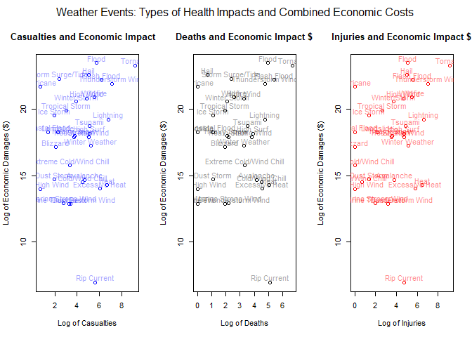

## Synopsis

Storms and other severe weather events can cause both public health and economic problems for communities and municipalities. Many severe events can result in fatalities, injuries, and property damage, and preventing such outcomes to the extent possible is a key concern.

This analysis will address that concern by identifying which types of storm events    

* are most harmful with respect to population health, and  
* have the greatest economic consequences.  

The data supporting this effort is drawn from the U.S. National Oceanic and Atmospheric Administration's (NOAA) [Storm Database][1]<sup>1</sup>, a repository that tracks the characteristics of major storms and weather events in the United States, such as when and where they occur, and estimates of any fatalities, injuries, and property damage.

This analysis reveals that for human cost, the most significant weather events are torandoes (1), thunderstorm winds (2), and flash floods (3).  Torandoes caused the most fatalities and injuries, outnumbering any other weather event by at least 3.5 times in either category.  Thunderstorm winds caused the second highest number of injuries across the U.S., while flash floods killed the second highest number of people for the period over which the analysis was conducted.

With regard to economic impact, tornades are again highly ranked, second, but floods caused the most damage for the U.S. over the period studied.  Floods caused $39.6 MM in damage on average per year, while tornnadoes came in a close second at $33.3 MM.  These were found to be the most damaging weather events, economically, beating out the nearest other severe weather event, hail, by nearly twice its effect ($161.0 MM).  

## Data Processing

From the 2012 version of the [Storm Database][1] (last reporting month being November 2011), we were able to obtain the needed information, such as the storm [event types][2]<sup>2</sup> and event dates, casualty counts (fatalities and injuries), estimates for property damage and crop damage, and the locations of these events with geographic specificity at the county-level (although, the analysis here will focus merely at the national level).  

### Reading in the Storm Database file for initial checking  


```r
library(readr)
library(ggplot2)
library(stringr)
library(xtable)
library(dplyr)
```

```
## 
## Attaching package: 'dplyr'
```

```
## The following objects are masked from 'package:stats':
## 
##     filter, lag
```

```
## The following objects are masked from 'package:base':
## 
##     intersect, setdiff, setequal, union
```

```r
#Class version = 2012 version of database (NCDC receives data from NWS between 60 and 90 days after the end of the data month.)
fileUrl<-"https://d396qusza40orc.cloudfront.net/repdata%2Fdata%2FStormData.csv.bz2"
download.file(fileUrl,destfile="./data/repdata_stormdata.csv.bz2",method="curl")


#initial inspection of file
chkFile<-read_csv("./data/repdata_stormdata.csv.bz2", n_max=1000)
```

```
## 
## -- Column specification --------------------------------------------------------
## cols(
##   .default = col_double(),
##   BGN_DATE = col_character(),
##   BGN_TIME = col_character(),
##   TIME_ZONE = col_character(),
##   COUNTYNAME = col_character(),
##   STATE = col_character(),
##   EVTYPE = col_character(),
##   BGN_AZI = col_logical(),
##   BGN_LOCATI = col_logical(),
##   END_DATE = col_logical(),
##   END_TIME = col_logical(),
##   COUNTYENDN = col_logical(),
##   END_AZI = col_logical(),
##   END_LOCATI = col_logical(),
##   PROPDMGEXP = col_character(),
##   CROPDMGEXP = col_logical(),
##   WFO = col_logical(),
##   STATEOFFIC = col_logical(),
##   ZONENAMES = col_logical(),
##   REMARKS = col_logical()
## )
## i Use `spec()` for the full column specifications.
```

```r
str(chkFile)
```

```
## spec_tbl_df[,37] [1,000 x 37] (S3: spec_tbl_df/tbl_df/tbl/data.frame)
##  $ STATE__   : num [1:1000] 1 1 1 1 1 1 1 1 1 1 ...
##  $ BGN_DATE  : chr [1:1000] "4/18/1950 0:00:00" "4/18/1950 0:00:00" "2/20/1951 0:00:00" "6/8/1951 0:00:00" ...
##  $ BGN_TIME  : chr [1:1000] "0130" "0145" "1600" "0900" ...
##  $ TIME_ZONE : chr [1:1000] "CST" "CST" "CST" "CST" ...
##  $ COUNTY    : num [1:1000] 97 3 57 89 43 77 9 123 125 57 ...
##  $ COUNTYNAME: chr [1:1000] "MOBILE" "BALDWIN" "FAYETTE" "MADISON" ...
##  $ STATE     : chr [1:1000] "AL" "AL" "AL" "AL" ...
##  $ EVTYPE    : chr [1:1000] "TORNADO" "TORNADO" "TORNADO" "TORNADO" ...
##  $ BGN_RANGE : num [1:1000] 0 0 0 0 0 0 0 0 0 0 ...
##  $ BGN_AZI   : logi [1:1000] NA NA NA NA NA NA ...
##  $ BGN_LOCATI: logi [1:1000] NA NA NA NA NA NA ...
##  $ END_DATE  : logi [1:1000] NA NA NA NA NA NA ...
##  $ END_TIME  : logi [1:1000] NA NA NA NA NA NA ...
##  $ COUNTY_END: num [1:1000] 0 0 0 0 0 0 0 0 0 0 ...
##  $ COUNTYENDN: logi [1:1000] NA NA NA NA NA NA ...
##  $ END_RANGE : num [1:1000] 0 0 0 0 0 0 0 0 0 0 ...
##  $ END_AZI   : logi [1:1000] NA NA NA NA NA NA ...
##  $ END_LOCATI: logi [1:1000] NA NA NA NA NA NA ...
##  $ LENGTH    : num [1:1000] 14 2 0.1 0 0 1.5 1.5 0 3.3 2.3 ...
##  $ WIDTH     : num [1:1000] 100 150 123 100 150 177 33 33 100 100 ...
##  $ F         : num [1:1000] 3 2 2 2 2 2 2 1 3 3 ...
##  $ MAG       : num [1:1000] 0 0 0 0 0 0 0 0 0 0 ...
##  $ FATALITIES: num [1:1000] 0 0 0 0 0 0 0 0 1 0 ...
##  $ INJURIES  : num [1:1000] 15 0 2 2 2 6 1 0 14 0 ...
##  $ PROPDMG   : num [1:1000] 25 2.5 25 2.5 2.5 2.5 2.5 2.5 25 25 ...
##  $ PROPDMGEXP: chr [1:1000] "K" "K" "K" "K" ...
##  $ CROPDMG   : num [1:1000] 0 0 0 0 0 0 0 0 0 0 ...
##  $ CROPDMGEXP: logi [1:1000] NA NA NA NA NA NA ...
##  $ WFO       : logi [1:1000] NA NA NA NA NA NA ...
##  $ STATEOFFIC: logi [1:1000] NA NA NA NA NA NA ...
##  $ ZONENAMES : logi [1:1000] NA NA NA NA NA NA ...
##  $ LATITUDE  : num [1:1000] 3040 3042 3340 3458 3412 ...
##  $ LONGITUDE : num [1:1000] 8812 8755 8742 8626 8642 ...
##  $ LATITUDE_E: num [1:1000] 3051 0 0 0 0 ...
##  $ LONGITUDE_: num [1:1000] 8806 0 0 0 0 ...
##  $ REMARKS   : logi [1:1000] NA NA NA NA NA NA ...
##  $ REFNUM    : num [1:1000] 1 2 3 4 5 6 7 8 9 10 ...
##  - attr(*, "spec")=
##   .. cols(
##   ..   STATE__ = col_double(),
##   ..   BGN_DATE = col_character(),
##   ..   BGN_TIME = col_character(),
##   ..   TIME_ZONE = col_character(),
##   ..   COUNTY = col_double(),
##   ..   COUNTYNAME = col_character(),
##   ..   STATE = col_character(),
##   ..   EVTYPE = col_character(),
##   ..   BGN_RANGE = col_double(),
##   ..   BGN_AZI = col_logical(),
##   ..   BGN_LOCATI = col_logical(),
##   ..   END_DATE = col_logical(),
##   ..   END_TIME = col_logical(),
##   ..   COUNTY_END = col_double(),
##   ..   COUNTYENDN = col_logical(),
##   ..   END_RANGE = col_double(),
##   ..   END_AZI = col_logical(),
##   ..   END_LOCATI = col_logical(),
##   ..   LENGTH = col_double(),
##   ..   WIDTH = col_double(),
##   ..   F = col_double(),
##   ..   MAG = col_double(),
##   ..   FATALITIES = col_double(),
##   ..   INJURIES = col_double(),
##   ..   PROPDMG = col_double(),
##   ..   PROPDMGEXP = col_character(),
##   ..   CROPDMG = col_double(),
##   ..   CROPDMGEXP = col_logical(),
##   ..   WFO = col_logical(),
##   ..   STATEOFFIC = col_logical(),
##   ..   ZONENAMES = col_logical(),
##   ..   LATITUDE = col_double(),
##   ..   LONGITUDE = col_double(),
##   ..   LATITUDE_E = col_double(),
##   ..   LONGITUDE_ = col_double(),
##   ..   REMARKS = col_logical(),
##   ..   REFNUM = col_double()
##   .. )
```

Here we see that a number of the columns will not be needed.  We will pull in only the needed columns.  
  
**Columns of Interest**  
  
* BGN_DATE                = Begin date is datetime character format and will need to be transformed to date mm/dd/yyyy.  Event start date.  
* TIME_ZONE               = Could be helpful if times or days are part of analysis, but we will not be working so granularly. (actually omitted in analysis)   
* COUNTY                  = This is the standard FIPS CODE, which is a character 4-digit code.  We transform this as such.  
* COUNTYNAME              = The full name of the county.  
* STATE                   = 2-letter state abbreviation.  
* EVTYPE                  = Values are Hail, Thunderstorm, etc. - spelled out; Standardized in August 2007.  We note "?" is in the field to be corrected later.  
* END_DATE                = End date is datetime character format and will need to be transformed to date mm/dd/yyyy. Event end date; not crucial to this study.   
* MAG                     = Wind speed (knots) or hail size in inches (to hundredths), depending on event.  
* FATALITIES              = Count of fatalities directly ascribed to the event.   
* INJURIES                = Count of injuries directly ascribed to the event.    
* PROPDMG                 = Numeric value (dd.dd) which represents the thousands, millions, etc. in property damage amounts. Used in conjunction with the PROPDMGEXP value.    
  
* PROPDMGEXP              = Indicates if PROPDMG is K(1000's), M(1,000,000s), or B (Billions). Standardized along with event types in August 2007.   
* CROPDMG                 = Numeric value (dd.dd) which represents the thousands, millions, etc. in crop damage  amounts. Used in conjunction with the CROPDMGEXP value.  
  
* CROPDMGEXP              =  Indicates if CROPDMG is K(1000's), M(1,000,000s), or B (Billions).  Standardized along with event types in August 2007.  

  
### Reading in the Storm Database file  
* Reading in  
* Filtering on columns of interest  
* Performing noted transformations  
* Adding aggregation variable begin_year for annualized views of results 
  
  
    

```r
analysisDF<-read_csv("./data/repdata_stormdata.csv.bz2", col_types="ncccncccnccccncnccnnnnnnncnccccnnnncn")
analysisDF<-analysisDF %>% 
        
        select(
                BGN_DATE,
                COUNTY,          #FIPS CODE
                COUNTYNAME,
                STATE,           #2-letter abbrev.
                EVTYPE,          #Hail, Thunderstorm, etc. - spelled out
                END_DATE,
                MAG,             #Wind speed (knots) or hail size in inches (to hundredths), depending on event
                FATALITIES,      #Count
                INJURIES,        #Count
                PROPDMG,         #Numeric value
                PROPDMGEXP,      #Indicates if numeric is K(1000's), M(1,000,000s), B
                CROPDMG,         #Numeric and *EXP same use as for PROPDMG
                CROPDMGEXP) %>% 
        
        mutate(
                begin_dt=as.Date(BGN_DATE, format =  "%m/%d/%Y %H:%M:%S"),
                county_fips=as.character(str_pad(COUNTY, width=4, side="left", pad="0")), #FIPS are 4 character numeric codes
                countyname=COUNTYNAME,
                state=STATE,
                event_type=str_to_title(EVTYPE),   #Many different cases used for same event type - so, make uniform
                end_date=as.Date(END_DATE, format =  "%m/%d/%Y %H:%M:%S"),
                magnitude=MAG,
                fatalities=FATALITIES,
                injuries=INJURIES,
                property_damage=PROPDMG,
                property_damage_scale=PROPDMGEXP,
                crop_damage=CROPDMG,
                crop_damage_scale=CROPDMGEXP) %>%
        
        select(
                begin_dt,
                county_fips,
                countyname,
                state,
                event_type,
                end_date,
                magnitude,
                fatalities,
                injuries,
                property_damage,
                property_damage_scale,
                crop_damage,
                crop_damage_scale)
               
analysisDF$begin_year<-as.integer(format(analysisDF$begin_dt, format="%Y"))

#analysisDF$event_type[analysisDF$event_type=="?"] <- "Unidentifed Type"   #To eliminate the single "?" entry
```

Now, we recognize from the *NWS Instruction 10-1605* (linked above), that standardization of event type names was instituted in August of 2007.  Also, this is when the monetary estimate tables were formalized, as shown in this Storm Data Preparation instruction.  So, we will investigate the entries for these fields ahead of any analysis.


```r
evt_table_ante<-xtable(table(sort(analysisDF$event_type[analysisDF$begin_year<2007])),caption="Before August 2007 Instruction", align="lr") #working on annual est.s later
names(evt_table_ante)<-c("Event Count")
evt_table_post<-xtable(table(sort(analysisDF$event_type[analysisDF$begin_year>2007])), caption="After August 2007 Instruction", align="lr") #working on annual est.s later
names(evt_table_post)<-c("Event Count")

#dmg_table<-xtable(table(analysisDF$property_damage_scale[analysisDF$begin_year>2007]))

print(evt_table_ante, include.colnames=TRUE, type="html")
```

<!-- html table generated in R 4.0.5 by xtable 1.8-4 package -->
<!-- Sat Aug 07 22:19:26 2021 -->
<table border=1>
<caption align="bottom"> Before August 2007 Instruction </caption>
<tr> <th>  </th> <th> Event Count </th>  </tr>
  <tr> <td> ? </td> <td align="right">   1 </td> </tr>
  <tr> <td> Abnormal Warmth </td> <td align="right">   4 </td> </tr>
  <tr> <td> Abnormally Dry </td> <td align="right">   2 </td> </tr>
  <tr> <td> Abnormally Wet </td> <td align="right">   1 </td> </tr>
  <tr> <td> Accumulated Snowfall </td> <td align="right">   4 </td> </tr>
  <tr> <td> Agricultural Freeze </td> <td align="right">   6 </td> </tr>
  <tr> <td> Apache County </td> <td align="right">   1 </td> </tr>
  <tr> <td> Astronomical High Tide </td> <td align="right"> 103 </td> </tr>
  <tr> <td> Avalance </td> <td align="right">   1 </td> </tr>
  <tr> <td> Avalanche </td> <td align="right"> 237 </td> </tr>
  <tr> <td> Beach Erosin </td> <td align="right">   1 </td> </tr>
  <tr> <td> Beach Erosion </td> <td align="right">   4 </td> </tr>
  <tr> <td> Beach Erosion/Coastal Flood </td> <td align="right">   1 </td> </tr>
  <tr> <td> Beach Flood </td> <td align="right">   2 </td> </tr>
  <tr> <td> Below Normal Precipitation </td> <td align="right">   2 </td> </tr>
  <tr> <td> Bitter Wind Chill </td> <td align="right">   1 </td> </tr>
  <tr> <td> Bitter Wind Chill Temperatures </td> <td align="right">   3 </td> </tr>
  <tr> <td> Black Ice </td> <td align="right">  17 </td> </tr>
  <tr> <td> Blizzard </td> <td align="right"> 1036 </td> </tr>
  <tr> <td> Blizzard And Extreme Wind Chil </td> <td align="right">   2 </td> </tr>
  <tr> <td> Blizzard And Heavy Snow </td> <td align="right">   1 </td> </tr>
  <tr> <td> Blizzard Summary </td> <td align="right">   1 </td> </tr>
  <tr> <td> Blizzard Weather </td> <td align="right">   1 </td> </tr>
  <tr> <td> Blizzard/Freezing Rain </td> <td align="right">   1 </td> </tr>
  <tr> <td> Blizzard/Heavy Snow </td> <td align="right">   2 </td> </tr>
  <tr> <td> Blizzard/High Wind </td> <td align="right">   1 </td> </tr>
  <tr> <td> Blizzard/Winter Storm </td> <td align="right">   1 </td> </tr>
  <tr> <td> Blow-Out Tide </td> <td align="right">   1 </td> </tr>
  <tr> <td> Blow-Out Tides </td> <td align="right">   1 </td> </tr>
  <tr> <td> Blowing Dust </td> <td align="right">   4 </td> </tr>
  <tr> <td> Blowing Snow </td> <td align="right">  17 </td> </tr>
  <tr> <td> Blowing Snow- Extreme Wind Chi </td> <td align="right">   1 </td> </tr>
  <tr> <td> Blowing Snow &amp; Extreme Wind Ch </td> <td align="right">   2 </td> </tr>
  <tr> <td> Blowing Snow/Extreme Wind Chil </td> <td align="right">   1 </td> </tr>
  <tr> <td> Breakup Flooding </td> <td align="right">   1 </td> </tr>
  <tr> <td> Brush Fire </td> <td align="right">   3 </td> </tr>
  <tr> <td> Brush Fires </td> <td align="right">   1 </td> </tr>
  <tr> <td> Coastal  Flooding/Erosion </td> <td align="right">   1 </td> </tr>
  <tr> <td> Coastal Erosion </td> <td align="right">   1 </td> </tr>
  <tr> <td> Coastal Flood </td> <td align="right"> 190 </td> </tr>
  <tr> <td> Coastal Flooding </td> <td align="right"> 183 </td> </tr>
  <tr> <td> Coastal Flooding/Erosion </td> <td align="right">   5 </td> </tr>
  <tr> <td> Coastal Storm </td> <td align="right">  10 </td> </tr>
  <tr> <td> Coastal Surge </td> <td align="right">   2 </td> </tr>
  <tr> <td> Coastal/Tidal Flood </td> <td align="right">   2 </td> </tr>
  <tr> <td> Coastalflood </td> <td align="right">   1 </td> </tr>
  <tr> <td> Coastalstorm </td> <td align="right">   1 </td> </tr>
  <tr> <td> Cold </td> <td align="right">  82 </td> </tr>
  <tr> <td> Cold Air Funnel </td> <td align="right">   4 </td> </tr>
  <tr> <td> Cold Air Funnels </td> <td align="right">   2 </td> </tr>
  <tr> <td> Cold Air Tornado </td> <td align="right">   1 </td> </tr>
  <tr> <td> Cold And Frost </td> <td align="right">   7 </td> </tr>
  <tr> <td> Cold And Snow </td> <td align="right">   1 </td> </tr>
  <tr> <td> Cold And Wet Conditions </td> <td align="right">   1 </td> </tr>
  <tr> <td> Cold Temperature </td> <td align="right">   2 </td> </tr>
  <tr> <td> Cold Temperatures </td> <td align="right">   4 </td> </tr>
  <tr> <td> Cold Wave </td> <td align="right">   3 </td> </tr>
  <tr> <td> Cold Weather </td> <td align="right">   4 </td> </tr>
  <tr> <td> Cold Wind Chill Temperatures </td> <td align="right">   6 </td> </tr>
  <tr> <td> Cold/Wind Chill </td> <td align="right">  21 </td> </tr>
  <tr> <td> Cold/Winds </td> <td align="right">   1 </td> </tr>
  <tr> <td> Cool And Wet </td> <td align="right">   1 </td> </tr>
  <tr> <td> Cool Spell </td> <td align="right">   1 </td> </tr>
  <tr> <td> Cstl Flooding/Erosion </td> <td align="right">   2 </td> </tr>
  <tr> <td> Dam Break </td> <td align="right">   4 </td> </tr>
  <tr> <td> Dam Failure </td> <td align="right">   1 </td> </tr>
  <tr> <td> Damaging Freeze </td> <td align="right">   8 </td> </tr>
  <tr> <td> Deep Hail </td> <td align="right">   1 </td> </tr>
  <tr> <td> Dense Fog </td> <td align="right"> 442 </td> </tr>
  <tr> <td> Dense Smoke </td> <td align="right">   1 </td> </tr>
  <tr> <td> Downburst </td> <td align="right">   2 </td> </tr>
  <tr> <td> Downburst Winds </td> <td align="right">   2 </td> </tr>
  <tr> <td> Driest Month </td> <td align="right">   1 </td> </tr>
  <tr> <td> Drifting Snow </td> <td align="right">   1 </td> </tr>
  <tr> <td> Drought </td> <td align="right"> 1173 </td> </tr>
  <tr> <td> Drought/Excessive Heat </td> <td align="right">  13 </td> </tr>
  <tr> <td> Drowning </td> <td align="right">   1 </td> </tr>
  <tr> <td> Dry </td> <td align="right">   9 </td> </tr>
  <tr> <td> Dry Conditions </td> <td align="right">   6 </td> </tr>
  <tr> <td> Dry Hot Weather </td> <td align="right">   1 </td> </tr>
  <tr> <td> Dry Microburst </td> <td align="right"> 186 </td> </tr>
  <tr> <td> Dry Microburst 50 </td> <td align="right">   1 </td> </tr>
  <tr> <td> Dry Microburst 53 </td> <td align="right">   1 </td> </tr>
  <tr> <td> Dry Microburst 58 </td> <td align="right">   2 </td> </tr>
  <tr> <td> Dry Microburst 61 </td> <td align="right">   1 </td> </tr>
  <tr> <td> Dry Microburst 84 </td> <td align="right">   1 </td> </tr>
  <tr> <td> Dry Microburst Winds </td> <td align="right">   5 </td> </tr>
  <tr> <td> Dry Mircoburst Winds </td> <td align="right">   1 </td> </tr>
  <tr> <td> Dry Pattern </td> <td align="right">   1 </td> </tr>
  <tr> <td> Dry Spell </td> <td align="right">   4 </td> </tr>
  <tr> <td> Dry Weather </td> <td align="right">   4 </td> </tr>
  <tr> <td> Dryness </td> <td align="right">   1 </td> </tr>
  <tr> <td> Dust Devel </td> <td align="right">   1 </td> </tr>
  <tr> <td> Dust Devil </td> <td align="right">  97 </td> </tr>
  <tr> <td> Dust Devil Waterspout </td> <td align="right">   1 </td> </tr>
  <tr> <td> Dust Storm </td> <td align="right"> 245 </td> </tr>
  <tr> <td> Dust Storm/High Winds </td> <td align="right">   1 </td> </tr>
  <tr> <td> Duststorm </td> <td align="right">   1 </td> </tr>
  <tr> <td> Early Freeze </td> <td align="right">   1 </td> </tr>
  <tr> <td> Early Frost </td> <td align="right">   2 </td> </tr>
  <tr> <td> Early Rain </td> <td align="right">   1 </td> </tr>
  <tr> <td> Early Snow </td> <td align="right">   3 </td> </tr>
  <tr> <td> Early Snowfall </td> <td align="right">   7 </td> </tr>
  <tr> <td> Erosion/Cstl Flood </td> <td align="right">   2 </td> </tr>
  <tr> <td> Excessive </td> <td align="right">   1 </td> </tr>
  <tr> <td> Excessive Cold </td> <td align="right">   2 </td> </tr>
  <tr> <td> Excessive Heat </td> <td align="right"> 1153 </td> </tr>
  <tr> <td> Excessive Heat/Drought </td> <td align="right">   1 </td> </tr>
  <tr> <td> Excessive Precipitation </td> <td align="right">   1 </td> </tr>
  <tr> <td> Excessive Rain </td> <td align="right">   5 </td> </tr>
  <tr> <td> Excessive Rainfall </td> <td align="right">   4 </td> </tr>
  <tr> <td> Excessive Snow </td> <td align="right">  25 </td> </tr>
  <tr> <td> Excessive Wetness </td> <td align="right">   1 </td> </tr>
  <tr> <td> Excessively Dry </td> <td align="right">   1 </td> </tr>
  <tr> <td> Extended Cold </td> <td align="right">   1 </td> </tr>
  <tr> <td> Extreme Cold </td> <td align="right"> 657 </td> </tr>
  <tr> <td> Extreme Cold/Wind Chill </td> <td align="right"> 294 </td> </tr>
  <tr> <td> Extreme Heat </td> <td align="right">  22 </td> </tr>
  <tr> <td> Extreme Wind Chill </td> <td align="right">   6 </td> </tr>
  <tr> <td> Extreme Wind Chill/Blowing Sno </td> <td align="right">   1 </td> </tr>
  <tr> <td> Extreme Wind Chills </td> <td align="right">   1 </td> </tr>
  <tr> <td> Extreme Windchill </td> <td align="right"> 204 </td> </tr>
  <tr> <td> Extreme Windchill Temperatures </td> <td align="right">  19 </td> </tr>
  <tr> <td> Extreme/Record Cold </td> <td align="right">   4 </td> </tr>
  <tr> <td> Extremely Wet </td> <td align="right">   1 </td> </tr>
  <tr> <td> Falling Snow/Ice </td> <td align="right">   2 </td> </tr>
  <tr> <td> First Frost </td> <td align="right">   1 </td> </tr>
  <tr> <td> First Snow </td> <td align="right">   9 </td> </tr>
  <tr> <td> Flash Flood </td> <td align="right"> 35182 </td> </tr>
  <tr> <td> Flash Flood - Heavy Rain </td> <td align="right">   2 </td> </tr>
  <tr> <td> Flash Flood From Ice Jams </td> <td align="right">   5 </td> </tr>
  <tr> <td> Flash Flood Landslides </td> <td align="right">   1 </td> </tr>
  <tr> <td> Flash Flood Winds </td> <td align="right">   1 </td> </tr>
  <tr> <td> Flash Flood/ </td> <td align="right">   1 </td> </tr>
  <tr> <td> Flash Flood/ Flood </td> <td align="right">   2 </td> </tr>
  <tr> <td> Flash Flood/ Street </td> <td align="right">   1 </td> </tr>
  <tr> <td> Flash Flood/Flood </td> <td align="right">  22 </td> </tr>
  <tr> <td> Flash Flood/Heavy Rain </td> <td align="right">   1 </td> </tr>
  <tr> <td> Flash Flood/Landslide </td> <td align="right">   1 </td> </tr>
  <tr> <td> Flash Flooding </td> <td align="right"> 682 </td> </tr>
  <tr> <td> Flash Flooding/Flood </td> <td align="right">   8 </td> </tr>
  <tr> <td> Flash Flooding/Thunderstorm Wi </td> <td align="right">   1 </td> </tr>
  <tr> <td> Flash Floods </td> <td align="right">  32 </td> </tr>
  <tr> <td> Flash Floooding </td> <td align="right">   1 </td> </tr>
  <tr> <td> Flood </td> <td align="right"> 12877 </td> </tr>
  <tr> <td> Flood &amp; Heavy Rain </td> <td align="right">   2 </td> </tr>
  <tr> <td> Flood Flash </td> <td align="right">   3 </td> </tr>
  <tr> <td> Flood Flood/Flash </td> <td align="right">   1 </td> </tr>
  <tr> <td> Flood Watch/ </td> <td align="right">   1 </td> </tr>
  <tr> <td> Flood/Flash </td> <td align="right">   2 </td> </tr>
  <tr> <td> Flood/Flash Flood </td> <td align="right"> 625 </td> </tr>
  <tr> <td> Flood/Flash Flooding </td> <td align="right">   2 </td> </tr>
  <tr> <td> Flood/Flash/Flood </td> <td align="right">   1 </td> </tr>
  <tr> <td> Flood/Flashflood </td> <td align="right">   1 </td> </tr>
  <tr> <td> Flood/Rain/Wind </td> <td align="right">   1 </td> </tr>
  <tr> <td> Flood/Rain/Winds </td> <td align="right">   6 </td> </tr>
  <tr> <td> Flood/River Flood </td> <td align="right">   1 </td> </tr>
  <tr> <td> Flood/Strong Wind </td> <td align="right">   1 </td> </tr>
  <tr> <td> Flooding </td> <td align="right"> 120 </td> </tr>
  <tr> <td> Flooding/Heavy Rain </td> <td align="right">   1 </td> </tr>
  <tr> <td> Floods </td> <td align="right">   3 </td> </tr>
  <tr> <td> Fog </td> <td align="right"> 538 </td> </tr>
  <tr> <td> Fog And Cold Temperatures </td> <td align="right">   1 </td> </tr>
  <tr> <td> Forest Fires </td> <td align="right">   1 </td> </tr>
  <tr> <td> Freeze </td> <td align="right">  76 </td> </tr>
  <tr> <td> Freezing Drizzle </td> <td align="right">  24 </td> </tr>
  <tr> <td> Freezing Drizzle And Freezing </td> <td align="right">   1 </td> </tr>
  <tr> <td> Freezing Fog </td> <td align="right">   8 </td> </tr>
  <tr> <td> Freezing Rain </td> <td align="right"> 260 </td> </tr>
  <tr> <td> Freezing Rain And Sleet </td> <td align="right">   6 </td> </tr>
  <tr> <td> Freezing Rain And Snow </td> <td align="right">   1 </td> </tr>
  <tr> <td> Freezing Rain Sleet And </td> <td align="right">   1 </td> </tr>
  <tr> <td> Freezing Rain Sleet And Light </td> <td align="right">   1 </td> </tr>
  <tr> <td> Freezing Rain/Sleet </td> <td align="right">   9 </td> </tr>
  <tr> <td> Freezing Rain/Snow </td> <td align="right">   4 </td> </tr>
  <tr> <td> Freezing Spray </td> <td align="right">   1 </td> </tr>
  <tr> <td> Frost </td> <td align="right">  57 </td> </tr>
  <tr> <td> Frost/Freeze </td> <td align="right"> 367 </td> </tr>
  <tr> <td> Frost\Freeze </td> <td align="right">   1 </td> </tr>
  <tr> <td> Funnel </td> <td align="right">  46 </td> </tr>
  <tr> <td> Funnel Cloud </td> <td align="right"> 4588 </td> </tr>
  <tr> <td> Funnel Cloud. </td> <td align="right">   1 </td> </tr>
  <tr> <td> Funnel Cloud/Hail </td> <td align="right">   1 </td> </tr>
  <tr> <td> Funnel Clouds </td> <td align="right">  87 </td> </tr>
  <tr> <td> Funnels </td> <td align="right">   1 </td> </tr>
  <tr> <td> Glaze </td> <td align="right">  43 </td> </tr>
  <tr> <td> Glaze Ice </td> <td align="right">   2 </td> </tr>
  <tr> <td> Glaze/Ice Storm </td> <td align="right">   1 </td> </tr>
  <tr> <td> Gradient Wind </td> <td align="right">   9 </td> </tr>
  <tr> <td> Gradient Winds </td> <td align="right">   8 </td> </tr>
  <tr> <td> Grass Fires </td> <td align="right">   1 </td> </tr>
  <tr> <td> Ground Blizzard </td> <td align="right">   2 </td> </tr>
  <tr> <td> Gustnado </td> <td align="right">   6 </td> </tr>
  <tr> <td> Gustnado And </td> <td align="right">   1 </td> </tr>
  <tr> <td> Gusty Lake Wind </td> <td align="right">   1 </td> </tr>
  <tr> <td> Gusty Thunderstorm Wind </td> <td align="right">   3 </td> </tr>
  <tr> <td> Gusty Thunderstorm Winds </td> <td align="right">   5 </td> </tr>
  <tr> <td> Gusty Wind </td> <td align="right">  24 </td> </tr>
  <tr> <td> Gusty Wind/Hail </td> <td align="right">   1 </td> </tr>
  <tr> <td> Gusty Wind/Hvy Rain </td> <td align="right">   1 </td> </tr>
  <tr> <td> Gusty Wind/Rain </td> <td align="right">   1 </td> </tr>
  <tr> <td> Gusty Winds </td> <td align="right">  65 </td> </tr>
  <tr> <td> Hail </td> <td align="right"> 216408 </td> </tr>
  <tr> <td> Hail 0.75 </td> <td align="right">  18 </td> </tr>
  <tr> <td> Hail 0.88 </td> <td align="right">   1 </td> </tr>
  <tr> <td> Hail 075 </td> <td align="right">   1 </td> </tr>
  <tr> <td> Hail 088 </td> <td align="right">   1 </td> </tr>
  <tr> <td> Hail 1.00 </td> <td align="right">   6 </td> </tr>
  <tr> <td> Hail 1.75 </td> <td align="right">   4 </td> </tr>
  <tr> <td> Hail 1.75) </td> <td align="right">   1 </td> </tr>
  <tr> <td> Hail 100 </td> <td align="right">  13 </td> </tr>
  <tr> <td> Hail 125 </td> <td align="right">   1 </td> </tr>
  <tr> <td> Hail 150 </td> <td align="right">   2 </td> </tr>
  <tr> <td> Hail 175 </td> <td align="right">  13 </td> </tr>
  <tr> <td> Hail 200 </td> <td align="right">   1 </td> </tr>
  <tr> <td> Hail 225 </td> <td align="right">   1 </td> </tr>
  <tr> <td> Hail 275 </td> <td align="right">   3 </td> </tr>
  <tr> <td> Hail 450 </td> <td align="right">   1 </td> </tr>
  <tr> <td> Hail 75 </td> <td align="right">  29 </td> </tr>
  <tr> <td> Hail 80 </td> <td align="right">   2 </td> </tr>
  <tr> <td> Hail 88 </td> <td align="right">   1 </td> </tr>
  <tr> <td> Hail Aloft </td> <td align="right">   1 </td> </tr>
  <tr> <td> Hail Damage </td> <td align="right">   2 </td> </tr>
  <tr> <td> Hail Flooding </td> <td align="right">   1 </td> </tr>
  <tr> <td> Hail Storm </td> <td align="right">   1 </td> </tr>
  <tr> <td> Hail(0.75) </td> <td align="right">   1 </td> </tr>
  <tr> <td> Hail/Icy Roads </td> <td align="right">   1 </td> </tr>
  <tr> <td> Hail/Wind </td> <td align="right">   3 </td> </tr>
  <tr> <td> Hail/Winds </td> <td align="right">   2 </td> </tr>
  <tr> <td> Hailstorm </td> <td align="right">   3 </td> </tr>
  <tr> <td> Hailstorms </td> <td align="right">   1 </td> </tr>
  <tr> <td> Hard Freeze </td> <td align="right">   7 </td> </tr>
  <tr> <td> Hazardous Surf </td> <td align="right">   1 </td> </tr>
  <tr> <td> Heat </td> <td align="right"> 146 </td> </tr>
  <tr> <td> Heat Drought </td> <td align="right">   1 </td> </tr>
  <tr> <td> Heat Wave </td> <td align="right">  75 </td> </tr>
  <tr> <td> Heat Wave Drought </td> <td align="right">   1 </td> </tr>
  <tr> <td> Heat Waves </td> <td align="right">   2 </td> </tr>
  <tr> <td> Heat/Drought </td> <td align="right">   1 </td> </tr>
  <tr> <td> Heatburst </td> <td align="right">   1 </td> </tr>
  <tr> <td> Heavy Lake Snow </td> <td align="right">  25 </td> </tr>
  <tr> <td> Heavy Mix </td> <td align="right">   8 </td> </tr>
  <tr> <td> Heavy Precipatation </td> <td align="right">   1 </td> </tr>
  <tr> <td> Heavy Precipitation </td> <td align="right">   3 </td> </tr>
  <tr> <td> Heavy Rain </td> <td align="right"> 6741 </td> </tr>
  <tr> <td> Heavy Rain And Flood </td> <td align="right">   1 </td> </tr>
  <tr> <td> Heavy Rain And Wind </td> <td align="right">   4 </td> </tr>
  <tr> <td> Heavy Rain Effects </td> <td align="right">   1 </td> </tr>
  <tr> <td> Heavy Rain/Flooding </td> <td align="right">   2 </td> </tr>
  <tr> <td> Heavy Rain/High Surf </td> <td align="right">   1 </td> </tr>
  <tr> <td> Heavy Rain/Lightning </td> <td align="right">   1 </td> </tr>
  <tr> <td> Heavy Rain/Mudslides/Flood </td> <td align="right">   1 </td> </tr>
  <tr> <td> Heavy Rain/Severe Weather </td> <td align="right">   2 </td> </tr>
  <tr> <td> Heavy Rain/Small Stream Urban </td> <td align="right">   1 </td> </tr>
  <tr> <td> Heavy Rain/Snow </td> <td align="right">   1 </td> </tr>
  <tr> <td> Heavy Rain/Urban Flood </td> <td align="right">   1 </td> </tr>
  <tr> <td> Heavy Rain/Wind </td> <td align="right">   4 </td> </tr>
  <tr> <td> Heavy Rain; Urban Flood Winds; </td> <td align="right">   1 </td> </tr>
  <tr> <td> Heavy Rainfall </td> <td align="right">   3 </td> </tr>
  <tr> <td> Heavy Rains </td> <td align="right">  26 </td> </tr>
  <tr> <td> Heavy Rains/Flooding </td> <td align="right">   9 </td> </tr>
  <tr> <td> Heavy Seas </td> <td align="right">   2 </td> </tr>
  <tr> <td> Heavy Shower </td> <td align="right">   2 </td> </tr>
  <tr> <td> Heavy Showers </td> <td align="right">   1 </td> </tr>
  <tr> <td> Heavy Snow </td> <td align="right"> 10080 </td> </tr>
  <tr> <td> Heavy Snow-Squalls </td> <td align="right">  15 </td> </tr>
  <tr> <td> Heavy Snow   Freezing Rain </td> <td align="right">   1 </td> </tr>
  <tr> <td> Heavy Snow &amp; Ice </td> <td align="right">   1 </td> </tr>
  <tr> <td> Heavy Snow And </td> <td align="right">   1 </td> </tr>
  <tr> <td> Heavy Snow And High Winds </td> <td align="right">   2 </td> </tr>
  <tr> <td> Heavy Snow And Ice </td> <td align="right">   2 </td> </tr>
  <tr> <td> Heavy Snow And Ice Storm </td> <td align="right">   2 </td> </tr>
  <tr> <td> Heavy Snow And Strong Winds </td> <td align="right">   1 </td> </tr>
  <tr> <td> Heavy Snow Andblowing Snow </td> <td align="right">   1 </td> </tr>
  <tr> <td> Heavy Snow Shower </td> <td align="right">   1 </td> </tr>
  <tr> <td> Heavy Snow Squalls </td> <td align="right">  32 </td> </tr>
  <tr> <td> Heavy Snow/Blizzard </td> <td align="right">   3 </td> </tr>
  <tr> <td> Heavy Snow/Blizzard/Avalanche </td> <td align="right">   1 </td> </tr>
  <tr> <td> Heavy Snow/Blowing Snow </td> <td align="right">   1 </td> </tr>
  <tr> <td> Heavy Snow/Freezing Rain </td> <td align="right">   2 </td> </tr>
  <tr> <td> Heavy Snow/High </td> <td align="right">   1 </td> </tr>
  <tr> <td> Heavy Snow/High Wind </td> <td align="right">   1 </td> </tr>
  <tr> <td> Heavy Snow/High Winds </td> <td align="right">   1 </td> </tr>
  <tr> <td> Heavy Snow/High Winds &amp; Flood </td> <td align="right">   1 </td> </tr>
  <tr> <td> Heavy Snow/High Winds/Freezing </td> <td align="right">   1 </td> </tr>
  <tr> <td> Heavy Snow/Ice </td> <td align="right">   5 </td> </tr>
  <tr> <td> Heavy Snow/Ice Storm </td> <td align="right">   2 </td> </tr>
  <tr> <td> Heavy Snow/Sleet </td> <td align="right">   1 </td> </tr>
  <tr> <td> Heavy Snow/Squalls </td> <td align="right">   2 </td> </tr>
  <tr> <td> Heavy Snow/Wind </td> <td align="right">   1 </td> </tr>
  <tr> <td> Heavy Snow/Winter Storm </td> <td align="right">   1 </td> </tr>
  <tr> <td> Heavy Snowpack </td> <td align="right">   1 </td> </tr>
  <tr> <td> Heavy Surf </td> <td align="right">  87 </td> </tr>
  <tr> <td> Heavy Surf And Wind </td> <td align="right">   1 </td> </tr>
  <tr> <td> Heavy Surf Coastal Flooding </td> <td align="right">   1 </td> </tr>
  <tr> <td> Heavy Surf/High Surf </td> <td align="right"> 228 </td> </tr>
  <tr> <td> Heavy Swells </td> <td align="right">   1 </td> </tr>
  <tr> <td> Heavy Wet Snow </td> <td align="right">   1 </td> </tr>
  <tr> <td> High </td> <td align="right">   1 </td> </tr>
  <tr> <td> High  Swells </td> <td align="right">   1 </td> </tr>
  <tr> <td> High  Winds </td> <td align="right">   1 </td> </tr>
  <tr> <td> High Seas </td> <td align="right">   8 </td> </tr>
  <tr> <td> High Surf </td> <td align="right"> 360 </td> </tr>
  <tr> <td> High Surf Advisories </td> <td align="right">   1 </td> </tr>
  <tr> <td> High Surf Advisory </td> <td align="right">   5 </td> </tr>
  <tr> <td> High Swells </td> <td align="right">   5 </td> </tr>
  <tr> <td> High Temperature Record </td> <td align="right">   3 </td> </tr>
  <tr> <td> High Tides </td> <td align="right">   2 </td> </tr>
  <tr> <td> High Water </td> <td align="right">   6 </td> </tr>
  <tr> <td> High Waves </td> <td align="right">   3 </td> </tr>
  <tr> <td> High Wind </td> <td align="right"> 9824 </td> </tr>
  <tr> <td> High Wind (G40) </td> <td align="right">   2 </td> </tr>
  <tr> <td> High Wind 48 </td> <td align="right">   1 </td> </tr>
  <tr> <td> High Wind 63 </td> <td align="right">   1 </td> </tr>
  <tr> <td> High Wind 70 </td> <td align="right">   1 </td> </tr>
  <tr> <td> High Wind And Heavy Snow </td> <td align="right">   1 </td> </tr>
  <tr> <td> High Wind And High Tides </td> <td align="right">   2 </td> </tr>
  <tr> <td> High Wind And Seas </td> <td align="right">   1 </td> </tr>
  <tr> <td> High Wind Damage </td> <td align="right">   2 </td> </tr>
  <tr> <td> High Wind/ Blizzard </td> <td align="right">   1 </td> </tr>
  <tr> <td> High Wind/Blizzard </td> <td align="right">   6 </td> </tr>
  <tr> <td> High Wind/Blizzard/Freezing Ra </td> <td align="right">   1 </td> </tr>
  <tr> <td> High Wind/Heavy Snow </td> <td align="right">   3 </td> </tr>
  <tr> <td> High Wind/Low Wind Chill </td> <td align="right">   1 </td> </tr>
  <tr> <td> High Wind/Seas </td> <td align="right">   1 </td> </tr>
  <tr> <td> High Wind/Wind Chill </td> <td align="right">   1 </td> </tr>
  <tr> <td> High Wind/Wind Chill/Blizzard </td> <td align="right">   1 </td> </tr>
  <tr> <td> High Winds </td> <td align="right"> 1533 </td> </tr>
  <tr> <td> High Winds 55 </td> <td align="right">   1 </td> </tr>
  <tr> <td> High Winds 57 </td> <td align="right">   1 </td> </tr>
  <tr> <td> High Winds 58 </td> <td align="right">   1 </td> </tr>
  <tr> <td> High Winds 63 </td> <td align="right">   2 </td> </tr>
  <tr> <td> High Winds 66 </td> <td align="right">   2 </td> </tr>
  <tr> <td> High Winds 67 </td> <td align="right">   1 </td> </tr>
  <tr> <td> High Winds 73 </td> <td align="right">   1 </td> </tr>
  <tr> <td> High Winds 76 </td> <td align="right">   1 </td> </tr>
  <tr> <td> High Winds 80 </td> <td align="right">   2 </td> </tr>
  <tr> <td> High Winds 82 </td> <td align="right">   1 </td> </tr>
  <tr> <td> High Winds And Wind Chill </td> <td align="right">   1 </td> </tr>
  <tr> <td> High Winds Dust Storm </td> <td align="right">   1 </td> </tr>
  <tr> <td> High Winds Heavy Rains </td> <td align="right">   1 </td> </tr>
  <tr> <td> High Winds/ </td> <td align="right">   1 </td> </tr>
  <tr> <td> High Winds/Coastal Flood </td> <td align="right">   1 </td> </tr>
  <tr> <td> High Winds/Cold </td> <td align="right">   5 </td> </tr>
  <tr> <td> High Winds/Flooding </td> <td align="right">   1 </td> </tr>
  <tr> <td> High Winds/Heavy Rain </td> <td align="right">   1 </td> </tr>
  <tr> <td> High Winds/Snow </td> <td align="right">   3 </td> </tr>
  <tr> <td> Highway Flooding </td> <td align="right">   1 </td> </tr>
  <tr> <td> Hot And Dry </td> <td align="right">   2 </td> </tr>
  <tr> <td> Hot Pattern </td> <td align="right">   1 </td> </tr>
  <tr> <td> Hot Spell </td> <td align="right">   2 </td> </tr>
  <tr> <td> Hot Weather </td> <td align="right">   1 </td> </tr>
  <tr> <td> Hot/Dry Pattern </td> <td align="right">   1 </td> </tr>
  <tr> <td> Hurricane </td> <td align="right"> 141 </td> </tr>
  <tr> <td> Hurricane-Generated Swells </td> <td align="right">   3 </td> </tr>
  <tr> <td> Hurricane Edouard </td> <td align="right">   2 </td> </tr>
  <tr> <td> Hurricane Emily </td> <td align="right">   1 </td> </tr>
  <tr> <td> Hurricane Erin </td> <td align="right">   7 </td> </tr>
  <tr> <td> Hurricane Felix </td> <td align="right">   2 </td> </tr>
  <tr> <td> Hurricane Gordon </td> <td align="right">   1 </td> </tr>
  <tr> <td> Hurricane Opal </td> <td align="right">   9 </td> </tr>
  <tr> <td> Hurricane Opal/High Winds </td> <td align="right">   1 </td> </tr>
  <tr> <td> Hurricane/Typhoon </td> <td align="right">  88 </td> </tr>
  <tr> <td> Hvy Rain </td> <td align="right">   2 </td> </tr>
  <tr> <td> Hyperthermia/Exposure </td> <td align="right">   1 </td> </tr>
  <tr> <td> Hypothermia </td> <td align="right">   1 </td> </tr>
  <tr> <td> Hypothermia/Exposure </td> <td align="right">   6 </td> </tr>
  <tr> <td> Ice </td> <td align="right">  61 </td> </tr>
  <tr> <td> Ice And Snow </td> <td align="right">   1 </td> </tr>
  <tr> <td> Ice Floes </td> <td align="right">   2 </td> </tr>
  <tr> <td> Ice Fog </td> <td align="right">   2 </td> </tr>
  <tr> <td> Ice Jam </td> <td align="right">   4 </td> </tr>
  <tr> <td> Ice Jam Flood (Minor </td> <td align="right">   1 </td> </tr>
  <tr> <td> Ice Jam Flooding </td> <td align="right">   5 </td> </tr>
  <tr> <td> Ice On Road </td> <td align="right">   1 </td> </tr>
  <tr> <td> Ice Pellets </td> <td align="right">   1 </td> </tr>
  <tr> <td> Ice Roads </td> <td align="right">   1 </td> </tr>
  <tr> <td> Ice Storm </td> <td align="right"> 1118 </td> </tr>
  <tr> <td> Ice Storm And Snow </td> <td align="right">   1 </td> </tr>
  <tr> <td> Ice Storm/Flash Flood </td> <td align="right">   1 </td> </tr>
  <tr> <td> Ice/Snow </td> <td align="right">   5 </td> </tr>
  <tr> <td> Ice/Strong Winds </td> <td align="right">   1 </td> </tr>
  <tr> <td> Icestorm/Blizzard </td> <td align="right">   1 </td> </tr>
  <tr> <td> Icy Roads </td> <td align="right">  32 </td> </tr>
  <tr> <td> Lack Of Snow </td> <td align="right">   1 </td> </tr>
  <tr> <td> Lake-Effect Snow </td> <td align="right">  72 </td> </tr>
  <tr> <td> Lake Effect Snow </td> <td align="right">  23 </td> </tr>
  <tr> <td> Lake Flood </td> <td align="right">   1 </td> </tr>
  <tr> <td> Lakeshore Flood </td> <td align="right">   1 </td> </tr>
  <tr> <td> Landslide </td> <td align="right"> 299 </td> </tr>
  <tr> <td> Landslide/Urban Flood </td> <td align="right">   1 </td> </tr>
  <tr> <td> Landslides </td> <td align="right">   8 </td> </tr>
  <tr> <td> Landslump </td> <td align="right">   2 </td> </tr>
  <tr> <td> Landspout </td> <td align="right">   2 </td> </tr>
  <tr> <td> Large Wall Cloud </td> <td align="right">   1 </td> </tr>
  <tr> <td> Late-Season Snowfall </td> <td align="right">   1 </td> </tr>
  <tr> <td> Late Freeze </td> <td align="right">   1 </td> </tr>
  <tr> <td> Late Season Hail </td> <td align="right">   1 </td> </tr>
  <tr> <td> Late Season Snow </td> <td align="right">   1 </td> </tr>
  <tr> <td> Late Season Snowfall </td> <td align="right">   2 </td> </tr>
  <tr> <td> Late Snow </td> <td align="right">   2 </td> </tr>
  <tr> <td> Light Freezing Rain </td> <td align="right">  23 </td> </tr>
  <tr> <td> Light Snow </td> <td align="right"> 176 </td> </tr>
  <tr> <td> Light Snow And Sleet </td> <td align="right">   2 </td> </tr>
  <tr> <td> Light Snow/Flurries </td> <td align="right">   3 </td> </tr>
  <tr> <td> Light Snow/Freezing Precip </td> <td align="right">   1 </td> </tr>
  <tr> <td> Light Snowfall </td> <td align="right">   1 </td> </tr>
  <tr> <td> Lighting </td> <td align="right">   3 </td> </tr>
  <tr> <td> Lightning </td> <td align="right"> 11881 </td> </tr>
  <tr> <td> Lightning  Wauseon </td> <td align="right">   1 </td> </tr>
  <tr> <td> Lightning And Heavy Rain </td> <td align="right">   1 </td> </tr>
  <tr> <td> Lightning And Thunderstorm Win </td> <td align="right">   1 </td> </tr>
  <tr> <td> Lightning And Winds </td> <td align="right">   1 </td> </tr>
  <tr> <td> Lightning Damage </td> <td align="right">   1 </td> </tr>
  <tr> <td> Lightning Fire </td> <td align="right">   1 </td> </tr>
  <tr> <td> Lightning Injury </td> <td align="right">   1 </td> </tr>
  <tr> <td> Lightning Thunderstorm Winds </td> <td align="right">   1 </td> </tr>
  <tr> <td> Lightning Thunderstorm Windss </td> <td align="right">   1 </td> </tr>
  <tr> <td> Lightning. </td> <td align="right">   1 </td> </tr>
  <tr> <td> Lightning/Heavy Rain </td> <td align="right">   1 </td> </tr>
  <tr> <td> Ligntning </td> <td align="right">   1 </td> </tr>
  <tr> <td> Local Flash Flood </td> <td align="right">   1 </td> </tr>
  <tr> <td> Local Flood </td> <td align="right">   1 </td> </tr>
  <tr> <td> Locally Heavy Rain </td> <td align="right">   1 </td> </tr>
  <tr> <td> Low Temperature </td> <td align="right">   7 </td> </tr>
  <tr> <td> Low Temperature Record </td> <td align="right">   1 </td> </tr>
  <tr> <td> Low Wind Chill </td> <td align="right">   1 </td> </tr>
  <tr> <td> Major Flood </td> <td align="right">   3 </td> </tr>
  <tr> <td> Marine Accident </td> <td align="right">   1 </td> </tr>
  <tr> <td> Marine Hail </td> <td align="right"> 242 </td> </tr>
  <tr> <td> Marine High Wind </td> <td align="right">  12 </td> </tr>
  <tr> <td> Marine Mishap </td> <td align="right">   2 </td> </tr>
  <tr> <td> Marine Strong Wind </td> <td align="right">   4 </td> </tr>
  <tr> <td> Marine Thunderstorm Wind </td> <td align="right"> 127 </td> </tr>
  <tr> <td> Marine Tstm Wind </td> <td align="right"> 6175 </td> </tr>
  <tr> <td> Metro Storm, May 26 </td> <td align="right">   1 </td> </tr>
  <tr> <td> Microburst </td> <td align="right">   9 </td> </tr>
  <tr> <td> Microburst Winds </td> <td align="right">   5 </td> </tr>
  <tr> <td> Mild And Dry Pattern </td> <td align="right">   1 </td> </tr>
  <tr> <td> Mild Pattern </td> <td align="right">   1 </td> </tr>
  <tr> <td> Mild/Dry Pattern </td> <td align="right">   1 </td> </tr>
  <tr> <td> Minor Flood </td> <td align="right">   1 </td> </tr>
  <tr> <td> Minor Flooding </td> <td align="right">   4 </td> </tr>
  <tr> <td> Mixed Precip </td> <td align="right">  10 </td> </tr>
  <tr> <td> Mixed Precipitation </td> <td align="right">  37 </td> </tr>
  <tr> <td> Moderate Snow </td> <td align="right">   1 </td> </tr>
  <tr> <td> Moderate Snowfall </td> <td align="right"> 101 </td> </tr>
  <tr> <td> Monthly Precipitation </td> <td align="right">  36 </td> </tr>
  <tr> <td> Monthly Rainfall </td> <td align="right">  13 </td> </tr>
  <tr> <td> Monthly Snowfall </td> <td align="right">   2 </td> </tr>
  <tr> <td> Monthly Temperature </td> <td align="right">   4 </td> </tr>
  <tr> <td> Mountain Snows </td> <td align="right">   1 </td> </tr>
  <tr> <td> Mud Slide </td> <td align="right">   7 </td> </tr>
  <tr> <td> Mud Slides </td> <td align="right">   1 </td> </tr>
  <tr> <td> Mud Slides Urban Flooding </td> <td align="right">   1 </td> </tr>
  <tr> <td> Mud/Rock Slide </td> <td align="right">   1 </td> </tr>
  <tr> <td> Mudslide </td> <td align="right">  17 </td> </tr>
  <tr> <td> Mudslide/Landslide </td> <td align="right">   1 </td> </tr>
  <tr> <td> Mudslides </td> <td align="right">   9 </td> </tr>
  <tr> <td> Near Record Snow </td> <td align="right">   1 </td> </tr>
  <tr> <td> No Severe Weather </td> <td align="right">   1 </td> </tr>
  <tr> <td> Non-Severe Wind Damage </td> <td align="right">   1 </td> </tr>
  <tr> <td> Non-Tstm Wind </td> <td align="right">   1 </td> </tr>
  <tr> <td> Non Severe Hail </td> <td align="right">   7 </td> </tr>
  <tr> <td> Non Tstm Wind </td> <td align="right">   2 </td> </tr>
  <tr> <td> None </td> <td align="right">   2 </td> </tr>
  <tr> <td> Normal Precipitation </td> <td align="right">   3 </td> </tr>
  <tr> <td> Northern Lights </td> <td align="right">   1 </td> </tr>
  <tr> <td> Other </td> <td align="right">  52 </td> </tr>
  <tr> <td> Patchy Dense Fog </td> <td align="right">   3 </td> </tr>
  <tr> <td> Patchy Ice </td> <td align="right">   1 </td> </tr>
  <tr> <td> Prolong Cold </td> <td align="right">  22 </td> </tr>
  <tr> <td> Prolong Cold/Snow </td> <td align="right">   1 </td> </tr>
  <tr> <td> Prolong Warmth </td> <td align="right">   4 </td> </tr>
  <tr> <td> Prolonged Rain </td> <td align="right">   4 </td> </tr>
  <tr> <td> Rain </td> <td align="right">  16 </td> </tr>
  <tr> <td> Rain (Heavy) </td> <td align="right">   1 </td> </tr>
  <tr> <td> Rain And Wind </td> <td align="right">   1 </td> </tr>
  <tr> <td> Rain Damage </td> <td align="right">   1 </td> </tr>
  <tr> <td> Rain/Snow </td> <td align="right">   5 </td> </tr>
  <tr> <td> Rain/Wind </td> <td align="right">   1 </td> </tr>
  <tr> <td> Rainstorm </td> <td align="right">   1 </td> </tr>
  <tr> <td> Rapidly Rising Water </td> <td align="right">   1 </td> </tr>
  <tr> <td> Record  Cold </td> <td align="right">   1 </td> </tr>
  <tr> <td> Record Cold </td> <td align="right">  67 </td> </tr>
  <tr> <td> Record Cold And High Wind </td> <td align="right">   1 </td> </tr>
  <tr> <td> Record Cold/Frost </td> <td align="right">   2 </td> </tr>
  <tr> <td> Record Cool </td> <td align="right">   5 </td> </tr>
  <tr> <td> Record Dry Month </td> <td align="right">   1 </td> </tr>
  <tr> <td> Record Dryness </td> <td align="right">   2 </td> </tr>
  <tr> <td> Record Heat </td> <td align="right">  82 </td> </tr>
  <tr> <td> Record Heat Wave </td> <td align="right">   1 </td> </tr>
  <tr> <td> Record High </td> <td align="right">   7 </td> </tr>
  <tr> <td> Record High Temperature </td> <td align="right">   3 </td> </tr>
  <tr> <td> Record High Temperatures </td> <td align="right">   1 </td> </tr>
  <tr> <td> Record Low </td> <td align="right">   4 </td> </tr>
  <tr> <td> Record Low Rainfall </td> <td align="right">   2 </td> </tr>
  <tr> <td> Record May Snow </td> <td align="right">   1 </td> </tr>
  <tr> <td> Record Precipitation </td> <td align="right">   1 </td> </tr>
  <tr> <td> Record Rainfall </td> <td align="right">  14 </td> </tr>
  <tr> <td> Record Snow </td> <td align="right">   8 </td> </tr>
  <tr> <td> Record Snow/Cold </td> <td align="right">   1 </td> </tr>
  <tr> <td> Record Snowfall </td> <td align="right">   6 </td> </tr>
  <tr> <td> Record Temperature </td> <td align="right">  16 </td> </tr>
  <tr> <td> Record Temperatures </td> <td align="right">   5 </td> </tr>
  <tr> <td> Record Warm </td> <td align="right">   1 </td> </tr>
  <tr> <td> Record Warm Temps. </td> <td align="right">   1 </td> </tr>
  <tr> <td> Record Warmth </td> <td align="right"> 154 </td> </tr>
  <tr> <td> Record Winter Snow </td> <td align="right">   3 </td> </tr>
  <tr> <td> Record/Excessive Heat </td> <td align="right">   3 </td> </tr>
  <tr> <td> Record/Excessive Rainfall </td> <td align="right">   1 </td> </tr>
  <tr> <td> Red Flag Criteria </td> <td align="right">   2 </td> </tr>
  <tr> <td> Red Flag Fire Wx </td> <td align="right">   2 </td> </tr>
  <tr> <td> Remnants Of Floyd </td> <td align="right">   2 </td> </tr>
  <tr> <td> Rip Current </td> <td align="right"> 198 </td> </tr>
  <tr> <td> Rip Currents </td> <td align="right"> 304 </td> </tr>
  <tr> <td> Rip Currents Heavy Surf </td> <td align="right">   1 </td> </tr>
  <tr> <td> Rip Currents/Heavy Surf </td> <td align="right">   2 </td> </tr>
  <tr> <td> River And Stream Flood </td> <td align="right">   2 </td> </tr>
  <tr> <td> River Flood </td> <td align="right"> 173 </td> </tr>
  <tr> <td> River Flooding </td> <td align="right">  29 </td> </tr>
  <tr> <td> Rock Slide </td> <td align="right">   2 </td> </tr>
  <tr> <td> Rogue Wave </td> <td align="right">   1 </td> </tr>
  <tr> <td> Rotating Wall Cloud </td> <td align="right">   5 </td> </tr>
  <tr> <td> Rough Seas </td> <td align="right">   3 </td> </tr>
  <tr> <td> Rough Surf </td> <td align="right">   4 </td> </tr>
  <tr> <td> Rural Flood </td> <td align="right">   2 </td> </tr>
  <tr> <td> Saharan Dust </td> <td align="right">   4 </td> </tr>
  <tr> <td> Seasonal Snowfall </td> <td align="right">   1 </td> </tr>
  <tr> <td> Seiche </td> <td align="right">  15 </td> </tr>
  <tr> <td> Severe Cold </td> <td align="right">   1 </td> </tr>
  <tr> <td> Severe Thunderstorm </td> <td align="right">  13 </td> </tr>
  <tr> <td> Severe Thunderstorm Winds </td> <td align="right">   5 </td> </tr>
  <tr> <td> Severe Thunderstorms </td> <td align="right">  23 </td> </tr>
  <tr> <td> Severe Turbulence </td> <td align="right">   1 </td> </tr>
  <tr> <td> Sleet </td> <td align="right">  11 </td> </tr>
  <tr> <td> Sleet &amp; Freezing Rain </td> <td align="right">   1 </td> </tr>
  <tr> <td> Sleet Storm </td> <td align="right">  12 </td> </tr>
  <tr> <td> Sleet/Freezing Rain </td> <td align="right">   2 </td> </tr>
  <tr> <td> Sleet/Ice Storm </td> <td align="right">   1 </td> </tr>
  <tr> <td> Sleet/Rain/Snow </td> <td align="right">   1 </td> </tr>
  <tr> <td> Sleet/Snow </td> <td align="right">   2 </td> </tr>
  <tr> <td> Small Hail </td> <td align="right">  53 </td> </tr>
  <tr> <td> Small Stream </td> <td align="right">   1 </td> </tr>
  <tr> <td> Small Stream And </td> <td align="right">   1 </td> </tr>
  <tr> <td> Small Stream And Urban Flood </td> <td align="right">   2 </td> </tr>
  <tr> <td> Small Stream And Urban Floodin </td> <td align="right">   1 </td> </tr>
  <tr> <td> Small Stream Flood </td> <td align="right">   7 </td> </tr>
  <tr> <td> Small Stream Flooding </td> <td align="right">   4 </td> </tr>
  <tr> <td> Small Stream Urban Flood </td> <td align="right">   1 </td> </tr>
  <tr> <td> Small Stream/Urban Flood </td> <td align="right">   5 </td> </tr>
  <tr> <td> Sml Stream Fld </td> <td align="right">   2 </td> </tr>
  <tr> <td> Smoke </td> <td align="right">  11 </td> </tr>
  <tr> <td> Snow </td> <td align="right"> 617 </td> </tr>
  <tr> <td> Snow- High Wind- Wind Chill </td> <td align="right">   1 </td> </tr>
  <tr> <td> Snow Accumulation </td> <td align="right">   2 </td> </tr>
  <tr> <td> Snow Advisory </td> <td align="right">   1 </td> </tr>
  <tr> <td> Snow And Cold </td> <td align="right">   2 </td> </tr>
  <tr> <td> Snow And Heavy Snow </td> <td align="right">   2 </td> </tr>
  <tr> <td> Snow And Ice </td> <td align="right">  34 </td> </tr>
  <tr> <td> Snow And Ice Storm </td> <td align="right">   1 </td> </tr>
  <tr> <td> Snow And Sleet </td> <td align="right">   5 </td> </tr>
  <tr> <td> Snow And Wind </td> <td align="right">   1 </td> </tr>
  <tr> <td> Snow Drought </td> <td align="right">   7 </td> </tr>
  <tr> <td> Snow Freezing Rain </td> <td align="right">  11 </td> </tr>
  <tr> <td> Snow Showers </td> <td align="right">   6 </td> </tr>
  <tr> <td> Snow Sleet </td> <td align="right">   1 </td> </tr>
  <tr> <td> Snow Squall </td> <td align="right">  19 </td> </tr>
  <tr> <td> Snow Squalls </td> <td align="right">  22 </td> </tr>
  <tr> <td> Snow/ Bitter Cold </td> <td align="right">   1 </td> </tr>
  <tr> <td> Snow/ Ice </td> <td align="right">   1 </td> </tr>
  <tr> <td> Snow/Blowing Snow </td> <td align="right">   7 </td> </tr>
  <tr> <td> Snow/Cold </td> <td align="right">   2 </td> </tr>
  <tr> <td> Snow/Freezing Rain </td> <td align="right">   6 </td> </tr>
  <tr> <td> Snow/Heavy Snow </td> <td align="right">   1 </td> </tr>
  <tr> <td> Snow/High Winds </td> <td align="right">   2 </td> </tr>
  <tr> <td> Snow/Ice </td> <td align="right">   7 </td> </tr>
  <tr> <td> Snow/Ice Storm </td> <td align="right">  17 </td> </tr>
  <tr> <td> Snow/Rain </td> <td align="right">   1 </td> </tr>
  <tr> <td> Snow/Rain/Sleet </td> <td align="right">   1 </td> </tr>
  <tr> <td> Snow/Sleet </td> <td align="right">  10 </td> </tr>
  <tr> <td> Snow/Sleet/Freezing Rain </td> <td align="right">   6 </td> </tr>
  <tr> <td> Snow/Sleet/Rain </td> <td align="right">   1 </td> </tr>
  <tr> <td> Snow\Cold </td> <td align="right">   1 </td> </tr>
  <tr> <td> Snowfall Record </td> <td align="right">   1 </td> </tr>
  <tr> <td> Snowmelt Flooding </td> <td align="right">   5 </td> </tr>
  <tr> <td> Snowstorm </td> <td align="right">   1 </td> </tr>
  <tr> <td> Southeast </td> <td align="right">   1 </td> </tr>
  <tr> <td> Storm Force Winds </td> <td align="right">   1 </td> </tr>
  <tr> <td> Storm Surge </td> <td align="right"> 261 </td> </tr>
  <tr> <td> Storm Surge/Tide </td> <td align="right">  14 </td> </tr>
  <tr> <td> Stream Flooding </td> <td align="right">   1 </td> </tr>
  <tr> <td> Street Flood </td> <td align="right">   3 </td> </tr>
  <tr> <td> Street Flooding </td> <td align="right">   3 </td> </tr>
  <tr> <td> Strong Wind </td> <td align="right"> 1144 </td> </tr>
  <tr> <td> Strong Wind Gust </td> <td align="right">   2 </td> </tr>
  <tr> <td> Strong Winds </td> <td align="right"> 204 </td> </tr>
  <tr> <td> Summary August 10 </td> <td align="right">   2 </td> </tr>
  <tr> <td> Summary August 11 </td> <td align="right">   2 </td> </tr>
  <tr> <td> Summary August 17 </td> <td align="right">   1 </td> </tr>
  <tr> <td> Summary August 2-3 </td> <td align="right">   1 </td> </tr>
  <tr> <td> Summary August 21 </td> <td align="right">   1 </td> </tr>
  <tr> <td> Summary August 28 </td> <td align="right">   1 </td> </tr>
  <tr> <td> Summary August 4 </td> <td align="right">   1 </td> </tr>
  <tr> <td> Summary August 7 </td> <td align="right">   1 </td> </tr>
  <tr> <td> Summary August 9 </td> <td align="right">   1 </td> </tr>
  <tr> <td> Summary Jan 17 </td> <td align="right">   1 </td> </tr>
  <tr> <td> Summary July 23-24 </td> <td align="right">   1 </td> </tr>
  <tr> <td> Summary June 18-19 </td> <td align="right">   1 </td> </tr>
  <tr> <td> Summary June 5-6 </td> <td align="right">   1 </td> </tr>
  <tr> <td> Summary June 6 </td> <td align="right">   1 </td> </tr>
  <tr> <td> Summary Of April 12 </td> <td align="right">   2 </td> </tr>
  <tr> <td> Summary Of April 13 </td> <td align="right">   1 </td> </tr>
  <tr> <td> Summary Of April 21 </td> <td align="right">   2 </td> </tr>
  <tr> <td> Summary Of April 27 </td> <td align="right">   1 </td> </tr>
  <tr> <td> Summary Of April 3rd </td> <td align="right">   1 </td> </tr>
  <tr> <td> Summary Of August 1 </td> <td align="right">   1 </td> </tr>
  <tr> <td> Summary Of July 11 </td> <td align="right">   1 </td> </tr>
  <tr> <td> Summary Of July 2 </td> <td align="right">   1 </td> </tr>
  <tr> <td> Summary Of July 22 </td> <td align="right">   1 </td> </tr>
  <tr> <td> Summary Of July 26 </td> <td align="right">   1 </td> </tr>
  <tr> <td> Summary Of July 29 </td> <td align="right">   1 </td> </tr>
  <tr> <td> Summary Of July 3 </td> <td align="right">   1 </td> </tr>
  <tr> <td> Summary Of June 10 </td> <td align="right">   1 </td> </tr>
  <tr> <td> Summary Of June 11 </td> <td align="right">   1 </td> </tr>
  <tr> <td> Summary Of June 12 </td> <td align="right">   1 </td> </tr>
  <tr> <td> Summary Of June 13 </td> <td align="right">   2 </td> </tr>
  <tr> <td> Summary Of June 15 </td> <td align="right">   1 </td> </tr>
  <tr> <td> Summary Of June 16 </td> <td align="right">   1 </td> </tr>
  <tr> <td> Summary Of June 18 </td> <td align="right">   1 </td> </tr>
  <tr> <td> Summary Of June 23 </td> <td align="right">   1 </td> </tr>
  <tr> <td> Summary Of June 24 </td> <td align="right">   1 </td> </tr>
  <tr> <td> Summary Of June 3 </td> <td align="right">   2 </td> </tr>
  <tr> <td> Summary Of June 30 </td> <td align="right">   1 </td> </tr>
  <tr> <td> Summary Of June 4 </td> <td align="right">   1 </td> </tr>
  <tr> <td> Summary Of June 6 </td> <td align="right">   1 </td> </tr>
  <tr> <td> Summary Of March 14 </td> <td align="right">   1 </td> </tr>
  <tr> <td> Summary Of March 23 </td> <td align="right">   2 </td> </tr>
  <tr> <td> Summary Of March 24 </td> <td align="right">   1 </td> </tr>
  <tr> <td> Summary Of March 24-25 </td> <td align="right">   1 </td> </tr>
  <tr> <td> Summary Of March 27 </td> <td align="right">   1 </td> </tr>
  <tr> <td> Summary Of March 29 </td> <td align="right">   1 </td> </tr>
  <tr> <td> Summary Of May 10 </td> <td align="right">   1 </td> </tr>
  <tr> <td> Summary Of May 13 </td> <td align="right">   1 </td> </tr>
  <tr> <td> Summary Of May 14 </td> <td align="right">   1 </td> </tr>
  <tr> <td> Summary Of May 22 </td> <td align="right">   1 </td> </tr>
  <tr> <td> Summary Of May 22 Am </td> <td align="right">   1 </td> </tr>
  <tr> <td> Summary Of May 22 Pm </td> <td align="right">   1 </td> </tr>
  <tr> <td> Summary Of May 26 Am </td> <td align="right">   1 </td> </tr>
  <tr> <td> Summary Of May 26 Pm </td> <td align="right">   1 </td> </tr>
  <tr> <td> Summary Of May 31 Am </td> <td align="right">   1 </td> </tr>
  <tr> <td> Summary Of May 31 Pm </td> <td align="right">   1 </td> </tr>
  <tr> <td> Summary Of May 9-10 </td> <td align="right">   1 </td> </tr>
  <tr> <td> Summary Sept. 25-26 </td> <td align="right">   1 </td> </tr>
  <tr> <td> Summary September 20 </td> <td align="right">   1 </td> </tr>
  <tr> <td> Summary September 23 </td> <td align="right">   2 </td> </tr>
  <tr> <td> Summary September 3 </td> <td align="right">   1 </td> </tr>
  <tr> <td> Summary September 4 </td> <td align="right">   1 </td> </tr>
  <tr> <td> Summary: Nov. 16 </td> <td align="right">   2 </td> </tr>
  <tr> <td> Summary: Nov. 6-7 </td> <td align="right">   1 </td> </tr>
  <tr> <td> Summary: Oct. 20-21 </td> <td align="right">   1 </td> </tr>
  <tr> <td> Summary: October 31 </td> <td align="right">   1 </td> </tr>
  <tr> <td> Summary: Sept. 18 </td> <td align="right">   1 </td> </tr>
  <tr> <td> Temperature Record </td> <td align="right">  43 </td> </tr>
  <tr> <td> Thuderstorm Winds </td> <td align="right">   2 </td> </tr>
  <tr> <td> Thundeerstorm Winds </td> <td align="right">   2 </td> </tr>
  <tr> <td> Thunderestorm Winds </td> <td align="right">   1 </td> </tr>
  <tr> <td> Thundersnow </td> <td align="right">   1 </td> </tr>
  <tr> <td> Thundersnow Shower </td> <td align="right">   1 </td> </tr>
  <tr> <td> Thunderstorm </td> <td align="right">  45 </td> </tr>
  <tr> <td> Thunderstorm  Winds </td> <td align="right">   7 </td> </tr>
  <tr> <td> Thunderstorm Damage </td> <td align="right">   2 </td> </tr>
  <tr> <td> Thunderstorm Damage To </td> <td align="right">   1 </td> </tr>
  <tr> <td> Thunderstorm Hail </td> <td align="right">   1 </td> </tr>
  <tr> <td> Thunderstorm W Inds </td> <td align="right">   1 </td> </tr>
  <tr> <td> Thunderstorm Wind </td> <td align="right"> 1901 </td> </tr>
  <tr> <td> Thunderstorm Wind (G40) </td> <td align="right">   1 </td> </tr>
  <tr> <td> Thunderstorm Wind 50 </td> <td align="right">   2 </td> </tr>
  <tr> <td> Thunderstorm Wind 52 </td> <td align="right">   1 </td> </tr>
  <tr> <td> Thunderstorm Wind 56 </td> <td align="right">   1 </td> </tr>
  <tr> <td> Thunderstorm Wind 59 </td> <td align="right">   1 </td> </tr>
  <tr> <td> Thunderstorm Wind 59 Mph </td> <td align="right">   1 </td> </tr>
  <tr> <td> Thunderstorm Wind 59 Mph. </td> <td align="right">   1 </td> </tr>
  <tr> <td> Thunderstorm Wind 60 Mph </td> <td align="right">   4 </td> </tr>
  <tr> <td> Thunderstorm Wind 65 Mph </td> <td align="right">   1 </td> </tr>
  <tr> <td> Thunderstorm Wind 65mph </td> <td align="right">   1 </td> </tr>
  <tr> <td> Thunderstorm Wind 69 </td> <td align="right">   1 </td> </tr>
  <tr> <td> Thunderstorm Wind 98 Mph </td> <td align="right">   1 </td> </tr>
  <tr> <td> Thunderstorm Wind G50 </td> <td align="right">   4 </td> </tr>
  <tr> <td> Thunderstorm Wind G51 </td> <td align="right">   1 </td> </tr>
  <tr> <td> Thunderstorm Wind G52 </td> <td align="right">   2 </td> </tr>
  <tr> <td> Thunderstorm Wind G55 </td> <td align="right">   1 </td> </tr>
  <tr> <td> Thunderstorm Wind G60 </td> <td align="right">   2 </td> </tr>
  <tr> <td> Thunderstorm Wind G61 </td> <td align="right">   1 </td> </tr>
  <tr> <td> Thunderstorm Wind Trees </td> <td align="right">   1 </td> </tr>
  <tr> <td> Thunderstorm Wind. </td> <td align="right">   1 </td> </tr>
  <tr> <td> Thunderstorm Wind/ Tree </td> <td align="right">   1 </td> </tr>
  <tr> <td> Thunderstorm Wind/ Trees </td> <td align="right">   4 </td> </tr>
  <tr> <td> Thunderstorm Wind/Awning </td> <td align="right">   1 </td> </tr>
  <tr> <td> Thunderstorm Wind/Hail </td> <td align="right">   1 </td> </tr>
  <tr> <td> Thunderstorm Wind/Lightning </td> <td align="right">   1 </td> </tr>
  <tr> <td> Thunderstorm Winds </td> <td align="right"> 20843 </td> </tr>
  <tr> <td> Thunderstorm Winds      Le Cen </td> <td align="right">   1 </td> </tr>
  <tr> <td> Thunderstorm Winds 13 </td> <td align="right">   1 </td> </tr>
  <tr> <td> Thunderstorm Winds 2 </td> <td align="right">   1 </td> </tr>
  <tr> <td> Thunderstorm Winds 50 </td> <td align="right">   1 </td> </tr>
  <tr> <td> Thunderstorm Winds 52 </td> <td align="right">   1 </td> </tr>
  <tr> <td> Thunderstorm Winds 53 </td> <td align="right">   1 </td> </tr>
  <tr> <td> Thunderstorm Winds 60 </td> <td align="right">   1 </td> </tr>
  <tr> <td> Thunderstorm Winds 61 </td> <td align="right">   1 </td> </tr>
  <tr> <td> Thunderstorm Winds 62 </td> <td align="right">   1 </td> </tr>
  <tr> <td> Thunderstorm Winds 63 Mph </td> <td align="right">   1 </td> </tr>
  <tr> <td> Thunderstorm Winds And </td> <td align="right">   2 </td> </tr>
  <tr> <td> Thunderstorm Winds Funnel Clou </td> <td align="right">   2 </td> </tr>
  <tr> <td> Thunderstorm Winds G </td> <td align="right">   2 </td> </tr>
  <tr> <td> Thunderstorm Winds G60 </td> <td align="right">   1 </td> </tr>
  <tr> <td> Thunderstorm Winds Hail </td> <td align="right">  61 </td> </tr>
  <tr> <td> Thunderstorm Winds Heavy Rain </td> <td align="right">   1 </td> </tr>
  <tr> <td> Thunderstorm Winds Lightning </td> <td align="right">   7 </td> </tr>
  <tr> <td> Thunderstorm Winds Small Strea </td> <td align="right">   1 </td> </tr>
  <tr> <td> Thunderstorm Winds Urban Flood </td> <td align="right">   1 </td> </tr>
  <tr> <td> Thunderstorm Winds. </td> <td align="right">   3 </td> </tr>
  <tr> <td> Thunderstorm Winds/ Flood </td> <td align="right">   2 </td> </tr>
  <tr> <td> Thunderstorm Winds/ Hail </td> <td align="right">   1 </td> </tr>
  <tr> <td> Thunderstorm Winds/Flash Flood </td> <td align="right">   1 </td> </tr>
  <tr> <td> Thunderstorm Winds/Flooding </td> <td align="right">   1 </td> </tr>
  <tr> <td> Thunderstorm Winds/Funnel Clou </td> <td align="right">   1 </td> </tr>
  <tr> <td> Thunderstorm Winds/Hail </td> <td align="right">  24 </td> </tr>
  <tr> <td> Thunderstorm Winds/Heavy Rain </td> <td align="right">   1 </td> </tr>
  <tr> <td> Thunderstorm Winds53 </td> <td align="right">   1 </td> </tr>
  <tr> <td> Thunderstorm Windshail </td> <td align="right">   1 </td> </tr>
  <tr> <td> Thunderstorm Windss </td> <td align="right">  51 </td> </tr>
  <tr> <td> Thunderstorm Wins </td> <td align="right">   1 </td> </tr>
  <tr> <td> Thunderstorms </td> <td align="right">   4 </td> </tr>
  <tr> <td> Thunderstorms Wind </td> <td align="right">   6 </td> </tr>
  <tr> <td> Thunderstorms Winds </td> <td align="right">  14 </td> </tr>
  <tr> <td> Thunderstormw </td> <td align="right">   1 </td> </tr>
  <tr> <td> Thunderstormw 50 </td> <td align="right">   1 </td> </tr>
  <tr> <td> Thunderstormw Winds </td> <td align="right">   3 </td> </tr>
  <tr> <td> Thunderstormwinds </td> <td align="right">   1 </td> </tr>
  <tr> <td> Thunderstrom Wind </td> <td align="right">   1 </td> </tr>
  <tr> <td> Thunderstrom Winds </td> <td align="right">   2 </td> </tr>
  <tr> <td> Thundertorm Winds </td> <td align="right">   3 </td> </tr>
  <tr> <td> Thundertsorm Wind </td> <td align="right">   1 </td> </tr>
  <tr> <td> Thundestorm Winds </td> <td align="right">   2 </td> </tr>
  <tr> <td> Thunerstorm Winds </td> <td align="right">   1 </td> </tr>
  <tr> <td> Tidal Flood </td> <td align="right">   1 </td> </tr>
  <tr> <td> Tidal Flooding </td> <td align="right">  25 </td> </tr>
  <tr> <td> Tornado </td> <td align="right"> 52613 </td> </tr>
  <tr> <td> Tornado Debris </td> <td align="right">   1 </td> </tr>
  <tr> <td> Tornado F0 </td> <td align="right">  19 </td> </tr>
  <tr> <td> Tornado F1 </td> <td align="right">   4 </td> </tr>
  <tr> <td> Tornado F2 </td> <td align="right">   3 </td> </tr>
  <tr> <td> Tornado F3 </td> <td align="right">   2 </td> </tr>
  <tr> <td> Tornado/Waterspout </td> <td align="right">   1 </td> </tr>
  <tr> <td> Tornadoes </td> <td align="right">   2 </td> </tr>
  <tr> <td> Tornadoes, Tstm Wind, Hail </td> <td align="right">   1 </td> </tr>
  <tr> <td> Tornados </td> <td align="right">   1 </td> </tr>
  <tr> <td> Torndao </td> <td align="right">   1 </td> </tr>
  <tr> <td> Torrential Rain </td> <td align="right">   1 </td> </tr>
  <tr> <td> Torrential Rainfall </td> <td align="right">   1 </td> </tr>
  <tr> <td> Tropical Depression </td> <td align="right">  34 </td> </tr>
  <tr> <td> Tropical Storm </td> <td align="right"> 310 </td> </tr>
  <tr> <td> Tropical Storm Alberto </td> <td align="right">   1 </td> </tr>
  <tr> <td> Tropical Storm Dean </td> <td align="right">   2 </td> </tr>
  <tr> <td> Tropical Storm Gordon </td> <td align="right">   1 </td> </tr>
  <tr> <td> Tropical Storm Jerry </td> <td align="right">   3 </td> </tr>
  <tr> <td> Tstm </td> <td align="right">   1 </td> </tr>
  <tr> <td> Tstm Heavy Rain </td> <td align="right">   3 </td> </tr>
  <tr> <td> Tstm Wind </td> <td align="right"> 219946 </td> </tr>
  <tr> <td> Tstm Wind  (G45) </td> <td align="right">   1 </td> </tr>
  <tr> <td> Tstm Wind (41) </td> <td align="right">   1 </td> </tr>
  <tr> <td> Tstm Wind (G35) </td> <td align="right">   1 </td> </tr>
  <tr> <td> Tstm Wind (G40) </td> <td align="right">  10 </td> </tr>
  <tr> <td> Tstm Wind (G45) </td> <td align="right">  40 </td> </tr>
  <tr> <td> Tstm Wind 40 </td> <td align="right">   1 </td> </tr>
  <tr> <td> Tstm Wind 45 </td> <td align="right">   1 </td> </tr>
  <tr> <td> Tstm Wind 50 </td> <td align="right">   1 </td> </tr>
  <tr> <td> Tstm Wind 51 </td> <td align="right">   2 </td> </tr>
  <tr> <td> Tstm Wind 52 </td> <td align="right">   5 </td> </tr>
  <tr> <td> Tstm Wind 55 </td> <td align="right">   3 </td> </tr>
  <tr> <td> Tstm Wind 65) </td> <td align="right">   1 </td> </tr>
  <tr> <td> Tstm Wind And Lightning </td> <td align="right">   1 </td> </tr>
  <tr> <td> Tstm Wind Damage </td> <td align="right">   1 </td> </tr>
  <tr> <td> Tstm Wind G45 </td> <td align="right">   1 </td> </tr>
  <tr> <td> Tstm Wind G58 </td> <td align="right">   1 </td> </tr>
  <tr> <td> Tstm Wind/Hail </td> <td align="right"> 1028 </td> </tr>
  <tr> <td> Tstm Winds </td> <td align="right">   6 </td> </tr>
  <tr> <td> Tstm Wnd </td> <td align="right">   1 </td> </tr>
  <tr> <td> Tstmw </td> <td align="right">   1 </td> </tr>
  <tr> <td> Tsunami </td> <td align="right">   4 </td> </tr>
  <tr> <td> Tunderstorm Wind </td> <td align="right">   1 </td> </tr>
  <tr> <td> Typhoon </td> <td align="right">  11 </td> </tr>
  <tr> <td> Unseasonable Cold </td> <td align="right">   1 </td> </tr>
  <tr> <td> Unseasonably Cold </td> <td align="right">  23 </td> </tr>
  <tr> <td> Unseasonably Cool </td> <td align="right">  12 </td> </tr>
  <tr> <td> Unseasonably Cool &amp; Wet </td> <td align="right">   2 </td> </tr>
  <tr> <td> Unseasonably Dry </td> <td align="right">  56 </td> </tr>
  <tr> <td> Unseasonably Hot </td> <td align="right">  10 </td> </tr>
  <tr> <td> Unseasonably Warm </td> <td align="right"> 126 </td> </tr>
  <tr> <td> Unseasonably Warm &amp; Wet </td> <td align="right">   1 </td> </tr>
  <tr> <td> Unseasonably Warm And Dry </td> <td align="right">  13 </td> </tr>
  <tr> <td> Unseasonably Warm Year </td> <td align="right">   2 </td> </tr>
  <tr> <td> Unseasonably Warm/Wet </td> <td align="right">   2 </td> </tr>
  <tr> <td> Unseasonably Wet </td> <td align="right">  19 </td> </tr>
  <tr> <td> Unseasonal Low Temp </td> <td align="right">   2 </td> </tr>
  <tr> <td> Unseasonal Rain </td> <td align="right">   2 </td> </tr>
  <tr> <td> Unusual Warmth </td> <td align="right">  10 </td> </tr>
  <tr> <td> Unusual/Record Warmth </td> <td align="right">   2 </td> </tr>
  <tr> <td> Unusually Cold </td> <td align="right">   8 </td> </tr>
  <tr> <td> Unusually Late Snow </td> <td align="right">   1 </td> </tr>
  <tr> <td> Unusually Warm </td> <td align="right">   4 </td> </tr>
  <tr> <td> Urban And Small </td> <td align="right">   2 </td> </tr>
  <tr> <td> Urban And Small Stream </td> <td align="right">   3 </td> </tr>
  <tr> <td> Urban And Small Stream Flood </td> <td align="right">   3 </td> </tr>
  <tr> <td> Urban And Small Stream Floodin </td> <td align="right">   6 </td> </tr>
  <tr> <td> Urban Flood </td> <td align="right"> 251 </td> </tr>
  <tr> <td> Urban Flood Landslide </td> <td align="right">   1 </td> </tr>
  <tr> <td> Urban Flooding </td> <td align="right">  99 </td> </tr>
  <tr> <td> Urban Floods </td> <td align="right">   3 </td> </tr>
  <tr> <td> Urban Small </td> <td align="right">   1 </td> </tr>
  <tr> <td> Urban Small Stream Flood </td> <td align="right">   2 </td> </tr>
  <tr> <td> Urban/Small </td> <td align="right">   2 </td> </tr>
  <tr> <td> Urban/Small Flooding </td> <td align="right">   1 </td> </tr>
  <tr> <td> Urban/Small Stream </td> <td align="right">   8 </td> </tr>
  <tr> <td> Urban/Small Stream  Flood </td> <td align="right">   2 </td> </tr>
  <tr> <td> Urban/Small Stream Flood </td> <td align="right">  30 </td> </tr>
  <tr> <td> Urban/Small Stream Flooding </td> <td align="right">   4 </td> </tr>
  <tr> <td> Urban/Small Strm Fldg </td> <td align="right">   1 </td> </tr>
  <tr> <td> Urban/Sml Stream Fld </td> <td align="right"> 3392 </td> </tr>
  <tr> <td> Urban/Sml Stream Fldg </td> <td align="right">   1 </td> </tr>
  <tr> <td> Urban/Street Flooding </td> <td align="right">   3 </td> </tr>
  <tr> <td> Very Dry </td> <td align="right">   2 </td> </tr>
  <tr> <td> Very Warm </td> <td align="right">   1 </td> </tr>
  <tr> <td> Vog </td> <td align="right">   1 </td> </tr>
  <tr> <td> Volcanic Ash </td> <td align="right">  23 </td> </tr>
  <tr> <td> Volcanic Ash Plume </td> <td align="right">   1 </td> </tr>
  <tr> <td> Volcanic Eruption </td> <td align="right">   2 </td> </tr>
  <tr> <td> Wake Low Wind </td> <td align="right">   2 </td> </tr>
  <tr> <td> Wall Cloud </td> <td align="right">   5 </td> </tr>
  <tr> <td> Wall Cloud/Funnel Cloud </td> <td align="right">   1 </td> </tr>
  <tr> <td> Warm Dry Conditions </td> <td align="right">   1 </td> </tr>
  <tr> <td> Warm Weather </td> <td align="right">   1 </td> </tr>
  <tr> <td> Water Spout </td> <td align="right">   1 </td> </tr>
  <tr> <td> Waterspout </td> <td align="right"> 2775 </td> </tr>
  <tr> <td> Waterspout- </td> <td align="right">  10 </td> </tr>
  <tr> <td> Waterspout-Tornado </td> <td align="right">   2 </td> </tr>
  <tr> <td> Waterspout Funnel Cloud </td> <td align="right">   1 </td> </tr>
  <tr> <td> Waterspout Tornado </td> <td align="right">   1 </td> </tr>
  <tr> <td> Waterspout/ </td> <td align="right">   1 </td> </tr>
  <tr> <td> Waterspout/ Tornado </td> <td align="right">   2 </td> </tr>
  <tr> <td> Waterspout/Tornado </td> <td align="right">   8 </td> </tr>
  <tr> <td> Waterspouts </td> <td align="right">  37 </td> </tr>
  <tr> <td> Wayterspout </td> <td align="right">   1 </td> </tr>
  <tr> <td> Wet Micoburst </td> <td align="right">   1 </td> </tr>
  <tr> <td> Wet Microburst </td> <td align="right">   6 </td> </tr>
  <tr> <td> Wet Month </td> <td align="right">   4 </td> </tr>
  <tr> <td> Wet Snow </td> <td align="right">   1 </td> </tr>
  <tr> <td> Wet Weather </td> <td align="right">   1 </td> </tr>
  <tr> <td> Wet Year </td> <td align="right">   4 </td> </tr>
  <tr> <td> Whirlwind </td> <td align="right">   3 </td> </tr>
  <tr> <td> Wild Fires </td> <td align="right">   4 </td> </tr>
  <tr> <td> Wild/Forest Fire </td> <td align="right"> 1457 </td> </tr>
  <tr> <td> Wild/Forest Fires </td> <td align="right">   1 </td> </tr>
  <tr> <td> Wildfire </td> <td align="right"> 1010 </td> </tr>
  <tr> <td> Wildfires </td> <td align="right">   8 </td> </tr>
  <tr> <td> Wind </td> <td align="right"> 347 </td> </tr>
  <tr> <td> Wind Advisory </td> <td align="right">  12 </td> </tr>
  <tr> <td> Wind And Wave </td> <td align="right">   1 </td> </tr>
  <tr> <td> Wind Chill </td> <td align="right">  18 </td> </tr>
  <tr> <td> Wind Chill/High Wind </td> <td align="right">   1 </td> </tr>
  <tr> <td> Wind Damage </td> <td align="right">  31 </td> </tr>
  <tr> <td> Wind Gusts </td> <td align="right">   3 </td> </tr>
  <tr> <td> Wind Storm </td> <td align="right">   1 </td> </tr>
  <tr> <td> Wind/Hail </td> <td align="right">   1 </td> </tr>
  <tr> <td> Winds </td> <td align="right">  36 </td> </tr>
  <tr> <td> Winter Mix </td> <td align="right">   3 </td> </tr>
  <tr> <td> Winter Storm </td> <td align="right"> 5043 </td> </tr>
  <tr> <td> Winter Storm High Winds </td> <td align="right">   1 </td> </tr>
  <tr> <td> Winter Storm/High Wind </td> <td align="right">   1 </td> </tr>
  <tr> <td> Winter Storm/High Winds </td> <td align="right">   1 </td> </tr>
  <tr> <td> Winter Storms </td> <td align="right">   3 </td> </tr>
  <tr> <td> Winter Weather </td> <td align="right"> 566 </td> </tr>
  <tr> <td> Winter Weather Mix </td> <td align="right">   6 </td> </tr>
  <tr> <td> Winter Weather/Mix </td> <td align="right"> 1104 </td> </tr>
  <tr> <td> Wintery Mix </td> <td align="right">   2 </td> </tr>
  <tr> <td> Wintry Mix </td> <td align="right">  94 </td> </tr>
  <tr> <td> Wnd </td> <td align="right">   1 </td> </tr>
   </table>

```r
print(evt_table_post, include.colnames=TRUE, type="html")
```

<!-- html table generated in R 4.0.5 by xtable 1.8-4 package -->
<!-- Sat Aug 07 22:19:26 2021 -->
<table border=1>
<caption align="bottom"> After August 2007 Instruction </caption>
<tr> <th>  </th> <th> Event Count </th>  </tr>
  <tr> <td> Astronomical Low Tide </td> <td align="right"> 130 </td> </tr>
  <tr> <td> Avalanche </td> <td align="right"> 122 </td> </tr>
  <tr> <td> Blizzard </td> <td align="right"> 1498 </td> </tr>
  <tr> <td> Coastal Flood </td> <td align="right"> 330 </td> </tr>
  <tr> <td> Cold/Wind Chill </td> <td align="right"> 406 </td> </tr>
  <tr> <td> Dense Fog </td> <td align="right"> 640 </td> </tr>
  <tr> <td> Dense Smoke </td> <td align="right">   6 </td> </tr>
  <tr> <td> Drought </td> <td align="right"> 996 </td> </tr>
  <tr> <td> Dust Devil </td> <td align="right">  46 </td> </tr>
  <tr> <td> Dust Storm </td> <td align="right"> 147 </td> </tr>
  <tr> <td> Excessive Heat </td> <td align="right"> 447 </td> </tr>
  <tr> <td> Extreme Cold/Wind Chill </td> <td align="right"> 614 </td> </tr>
  <tr> <td> Flash Flood </td> <td align="right"> 15408 </td> </tr>
  <tr> <td> Flood </td> <td align="right"> 10646 </td> </tr>
  <tr> <td> Freezing Fog </td> <td align="right">  30 </td> </tr>
  <tr> <td> Frost/Freeze </td> <td align="right"> 690 </td> </tr>
  <tr> <td> Funnel Cloud </td> <td align="right"> 1916 </td> </tr>
  <tr> <td> Hail </td> <td align="right"> 59542 </td> </tr>
  <tr> <td> Heat </td> <td align="right"> 545 </td> </tr>
  <tr> <td> Heavy Rain </td> <td align="right"> 4127 </td> </tr>
  <tr> <td> Heavy Snow </td> <td align="right"> 4684 </td> </tr>
  <tr> <td> High Surf </td> <td align="right"> 296 </td> </tr>
  <tr> <td> High Wind </td> <td align="right"> 8763 </td> </tr>
  <tr> <td> Hurricane </td> <td align="right">  28 </td> </tr>
  <tr> <td> Ice Storm </td> <td align="right"> 512 </td> </tr>
  <tr> <td> Lake-Effect Snow </td> <td align="right"> 425 </td> </tr>
  <tr> <td> Lakeshore Flood </td> <td align="right">  20 </td> </tr>
  <tr> <td> Landslide </td> <td align="right"> 235 </td> </tr>
  <tr> <td> Lightning </td> <td align="right"> 3155 </td> </tr>
  <tr> <td> Marine Hail </td> <td align="right"> 147 </td> </tr>
  <tr> <td> Marine High Wind </td> <td align="right"> 122 </td> </tr>
  <tr> <td> Marine Strong Wind </td> <td align="right">  36 </td> </tr>
  <tr> <td> Marine Thunderstorm Wind </td> <td align="right"> 4815 </td> </tr>
  <tr> <td> Rip Current </td> <td align="right"> 217 </td> </tr>
  <tr> <td> Seiche </td> <td align="right">   6 </td> </tr>
  <tr> <td> Sleet </td> <td align="right">  40 </td> </tr>
  <tr> <td> Storm Surge/Tide </td> <td align="right"> 127 </td> </tr>
  <tr> <td> Strong Wind </td> <td align="right"> 2087 </td> </tr>
  <tr> <td> Thunderstorm Wind </td> <td align="right"> 67665 </td> </tr>
  <tr> <td> Tornado </td> <td align="right"> 6801 </td> </tr>
  <tr> <td> Tropical Depression </td> <td align="right">  21 </td> </tr>
  <tr> <td> Tropical Storm </td> <td align="right"> 360 </td> </tr>
  <tr> <td> Tsunami </td> <td align="right">  16 </td> </tr>
  <tr> <td> Volcanic Ashfall </td> <td align="right">   2 </td> </tr>
  <tr> <td> Waterspout </td> <td align="right"> 747 </td> </tr>
  <tr> <td> Wildfire </td> <td align="right"> 1501 </td> </tr>
  <tr> <td> Winter Storm </td> <td align="right"> 5354 </td> </tr>
  <tr> <td> Winter Weather </td> <td align="right"> 5347 </td> </tr>
   </table>
  
Here we see that the Event Type names distribution prior to August 2007 lacks any regularity, and it would require much effort to standardize these values.  There are items like "Dry" and "Dry Conditions" that would need to be collapsed properly, as well as items like "Blizzard" and "Blizzard Weather"; also, it would be unclear how to collapse "Blizzard Summary" with all the other "Blizzard..." entries, or "Excessive" with all of the other "Excessive..." entries.  There are numerous other such difficulties with the pre-2007 data.  

On the other hand, we can see that the Event Type names fit the regularity demanded by NWS Instruction 10-1605.  

We are looking to understand how weather events impact people physically and economically.  Recent annual data covering the years 2008, 2009, 2010, and 2011, should suffice to deliver the desired indications.  

It is merely left to ensure the coding for the damage scaling fields meet the same regularity as seen for Event Type post-2007.  
  
  

```r
prop_scale_table<-xtable(table(sort(analysisDF$property_damage_scale[analysisDF$begin_year>2007])),caption="Property Damage Scalings", align="lr") #working on annual est.s later
names(prop_scale_table)<-c("Scalings Count")
crop_scale_table<-xtable(table(sort(analysisDF$crop_damage_scale[analysisDF$begin_year>2007])), caption="Crop Damage Scalings", align="lr") #working on annual est.s later
names(crop_scale_table)<-c("Scalings Count")

#dmg_table<-xtable(table(analysisDF$property_damage_scale[analysisDF$begin_year>2007]))

print(prop_scale_table, include.colnames=TRUE, type="html")
```

<!-- html table generated in R 4.0.5 by xtable 1.8-4 package -->
<!-- Sat Aug 07 22:19:26 2021 -->
<table border=1>
<caption align="bottom"> Property Damage Scalings </caption>
<tr> <th>  </th> <th> Scalings Count </th>  </tr>
  <tr> <td> 0 </td> <td align="right">   1 </td> </tr>
  <tr> <td> B </td> <td align="right">   9 </td> </tr>
  <tr> <td> K </td> <td align="right"> 209425 </td> </tr>
  <tr> <td> M </td> <td align="right"> 2380 </td> </tr>
   </table>

```r
print(crop_scale_table, include.colnames=TRUE, type="html")
```

<!-- html table generated in R 4.0.5 by xtable 1.8-4 package -->
<!-- Sat Aug 07 22:19:26 2021 -->
<table border=1>
<caption align="bottom"> Crop Damage Scalings </caption>
<tr> <th>  </th> <th> Scalings Count </th>  </tr>
  <tr> <td> B </td> <td align="right">   2 </td> </tr>
  <tr> <td> K </td> <td align="right"> 211312 </td> </tr>
  <tr> <td> M </td> <td align="right"> 501 </td> </tr>
   </table>
  
    
So, we see that the scalings have the regularity sought.  For property damage, we need only multiply the property damage value in property_damage by the appropriate scaling, as indicated in the property_damage_scale field.  For example, if the scale is "K", we will multiply property_damage by 1,000, and if the scale is "B", we will multiply property_damage by 10<sup>9</sup>.  This same operation wil be performed for the crop_damage estimates using the crop_damage_scale values.  Total economic impact will be the sum of these two estimates.


```r
#Get numeric factors
analysisDF<-filter(analysisDF, begin_year>2007) %>% mutate(
        property_damage_factor=(ifelse(property_damage_scale=="B",10^9,(ifelse(property_damage_scale=="M",10^6,(ifelse(property_damage_scale=="K",10^3,1)))))),
        crop_damage_factor=(ifelse(crop_damage_scale=="B",10^9,(ifelse(crop_damage_scale=="M",10^6,(ifelse(crop_damage_scale=="K",10^3,1))))))
        )

#Check mapping
table(analysisDF$property_damage_factor,analysisDF$property_damage_scale)
```

```
##        
##              0      B      K      M
##   1          1      0      0      0
##   1000       0      0 209425      0
##   1e+06      0      0      0   2380
##   1e+09      0      9      0      0
```

```r
table(analysisDF$crop_damage_factor,analysisDF$crop_damage_scale)
```

```
##        
##              B      K      M
##   1000       0 211312      0
##   1e+06      0      0    501
##   1e+09      2      0      0
```

```r
#Only diagonals are occupied => proper mapping

analysisDF<-filter(analysisDF, begin_year>2007) %>% mutate(
        property_damage_dollars=property_damage*property_damage_factor,
        crop_damage_dollars=crop_damage*crop_damage_factor,
        econ_damage_dollars=property_damage_dollars+crop_damage_dollars,
        casualties=fatalities+injuries
        
)

#Check new calcs
analysisDF[analysisDF$econ_damage_dollars!=(analysisDF$property_damage_dollars+analysisDF$crop_damage_dollars),]
```

```
## # A tibble: 0 x 20
## # ... with 20 variables: begin_dt <date>, county_fips <chr>, countyname <chr>,
## #   state <chr>, event_type <chr>, end_date <date>, magnitude <dbl>,
## #   fatalities <dbl>, injuries <dbl>, property_damage <dbl>,
## #   property_damage_scale <chr>, crop_damage <dbl>, crop_damage_scale <chr>,
## #   begin_year <int>, property_damage_factor <dbl>, crop_damage_factor <dbl>,
## #   property_damage_dollars <dbl>, crop_damage_dollars <dbl>,
## #   econ_damage_dollars <dbl>, casualties <dbl>
```

```r
analysisDF[analysisDF$casualties!=(analysisDF$fatalities+analysisDF$injuries),]
```

```
## # A tibble: 0 x 20
## # ... with 20 variables: begin_dt <date>, county_fips <chr>, countyname <chr>,
## #   state <chr>, event_type <chr>, end_date <date>, magnitude <dbl>,
## #   fatalities <dbl>, injuries <dbl>, property_damage <dbl>,
## #   property_damage_scale <chr>, crop_damage <dbl>, crop_damage_scale <chr>,
## #   begin_year <int>, property_damage_factor <dbl>, crop_damage_factor <dbl>,
## #   property_damage_dollars <dbl>, crop_damage_dollars <dbl>,
## #   econ_damage_dollars <dbl>, casualties <dbl>
```

```r
#We see zero rows returned => proper map
```
  
  
## Results

**Analysis covers entire U.S. for the four (4) years 2008-2011**
    
We will aggregate the impacts for human cost and economic cost over the four years.  This will allow us to determine a ranking by event type for each cost.
  
  

```r
annual_event_stats<-analysisDF %>% group_by(event_type, begin_year) %>% 
        summarize(casualties=sum(casualties), fatalities=sum(fatalities), injuries=sum(injuries), econ_damage_dollars=sum(econ_damage_dollars)) %>%
        arrange(event_type, begin_year)
```

```
## `summarise()` has grouped output by 'event_type'. You can override using the `.groups` argument.
```

```r
total_event_stats<-analysisDF %>% group_by(event_type) %>% 
        summarize(casualties=sum(casualties), fatalities=sum(fatalities), injuries=sum(injuries), econ_damage_dollars=sum(econ_damage_dollars)) %>%
        arrange(event_type)

total_econ<-total_event_stats[order(total_event_stats$econ_damage_dollars, decreasing=TRUE),]
total_pop<-total_event_stats[order(total_event_stats$casualties, decreasing=TRUE),]
```
  

```r
total_econ_table<-xtable(total_econ[,c(1,5)],caption="Economic Impact Ranking")
names(total_econ_table)<-c("Event Type","Economic Damage Dollars")
print(total_econ_table, include.colnames=TRUE, format.args = list(big.mark = ",", decimal.mark = "."), type="html")
```

<!-- html table generated in R 4.0.5 by xtable 1.8-4 package -->
<!-- Sat Aug 07 22:19:27 2021 -->
<table border=1>
<caption align="bottom"> Economic Impact Ranking </caption>
<tr> <th>  </th> <th> Event Type </th> <th> Economic Damage Dollars </th>  </tr>
  <tr> <td align="right"> 1 </td> <td> Flood </td> <td align="right"> 15,824,587,300.00 </td> </tr>
  <tr> <td align="right"> 2 </td> <td> Tornado </td> <td align="right"> 13,324,261,090.00 </td> </tr>
  <tr> <td align="right"> 3 </td> <td> Hail </td> <td align="right"> 6,436,795,350.00 </td> </tr>
  <tr> <td align="right"> 4 </td> <td> Storm Surge/Tide </td> <td align="right"> 4,637,493,000.00 </td> </tr>
  <tr> <td align="right"> 5 </td> <td> Flash Flood </td> <td align="right"> 4,475,061,230.00 </td> </tr>
  <tr> <td align="right"> 6 </td> <td> Thunderstorm Wind </td> <td align="right"> 3,365,070,240.00 </td> </tr>
  <tr> <td align="right"> 7 </td> <td> Hurricane </td> <td align="right"> 2,610,410,000.00 </td> </tr>
  <tr> <td align="right"> 8 </td> <td> Wildfire </td> <td align="right"> 1,200,903,770.00 </td> </tr>
  <tr> <td align="right"> 9 </td> <td> High Wind </td> <td align="right"> 1,094,884,540.00 </td> </tr>
  <tr> <td align="right"> 10 </td> <td> Winter Storm </td> <td align="right"> 885,255,000.00 </td> </tr>
  <tr> <td align="right"> 11 </td> <td> Frost/Freeze </td> <td align="right"> 561,582,000.00 </td> </tr>
  <tr> <td align="right"> 12 </td> <td> Tropical Storm </td> <td align="right"> 443,157,350.00 </td> </tr>
  <tr> <td align="right"> 13 </td> <td> Ice Storm </td> <td align="right"> 305,878,300.00 </td> </tr>
  <tr> <td align="right"> 14 </td> <td> Lightning </td> <td align="right"> 221,536,630.00 </td> </tr>
  <tr> <td align="right"> 15 </td> <td> Tsunami </td> <td align="right"> 134,879,000.00 </td> </tr>
  <tr> <td align="right"> 16 </td> <td> Coastal Flood </td> <td align="right"> 87,076,500.00 </td> </tr>
  <tr> <td align="right"> 17 </td> <td> Landslide </td> <td align="right"> 84,858,000.00 </td> </tr>
  <tr> <td align="right"> 18 </td> <td> High Surf </td> <td align="right"> 75,612,500.00 </td> </tr>
  <tr> <td align="right"> 19 </td> <td> Heavy Snow </td> <td align="right"> 66,651,100.00 </td> </tr>
  <tr> <td align="right"> 20 </td> <td> Heavy Rain </td> <td align="right"> 59,926,000.00 </td> </tr>
  <tr> <td align="right"> 21 </td> <td> Strong Wind </td> <td align="right"> 57,830,240.00 </td> </tr>
  <tr> <td align="right"> 22 </td> <td> Drought </td> <td align="right"> 51,828,000.00 </td> </tr>
  <tr> <td align="right"> 23 </td> <td> Winter Weather </td> <td align="right"> 31,502,500.00 </td> </tr>
  <tr> <td align="right"> 24 </td> <td> Blizzard </td> <td align="right"> 28,462,000.00 </td> </tr>
  <tr> <td align="right"> 25 </td> <td> Lake-Effect Snow </td> <td align="right"> 11,836,000.00 </td> </tr>
  <tr> <td align="right"> 26 </td> <td> Lakeshore Flood </td> <td align="right"> 7,500,000.00 </td> </tr>
  <tr> <td align="right"> 27 </td> <td> Extreme Cold/Wind Chill </td> <td align="right"> 7,035,000.00 </td> </tr>
  <tr> <td align="right"> 28 </td> <td> Waterspout </td> <td align="right"> 5,131,200.00 </td> </tr>
  <tr> <td align="right"> 29 </td> <td> Dust Storm </td> <td align="right"> 2,398,000.00 </td> </tr>
  <tr> <td align="right"> 30 </td> <td> Avalanche </td> <td align="right"> 2,383,800.00 </td> </tr>
  <tr> <td align="right"> 31 </td> <td> Dense Fog </td> <td align="right"> 2,322,000.00 </td> </tr>
  <tr> <td align="right"> 32 </td> <td> Freezing Fog </td> <td align="right"> 2,182,000.00 </td> </tr>
  <tr> <td align="right"> 33 </td> <td> Cold/Wind Chill </td> <td align="right"> 1,999,000.00 </td> </tr>
  <tr> <td align="right"> 34 </td> <td> Heat </td> <td align="right"> 1,610,000.00 </td> </tr>
  <tr> <td align="right"> 35 </td> <td> Tropical Depression </td> <td align="right"> 1,302,000.00 </td> </tr>
  <tr> <td align="right"> 36 </td> <td> Excessive Heat </td> <td align="right"> 1,233,200.00 </td> </tr>
  <tr> <td align="right"> 37 </td> <td> Marine High Wind </td> <td align="right"> 1,140,010.00 </td> </tr>
  <tr> <td align="right"> 38 </td> <td> Marine Strong Wind </td> <td align="right"> 399,330.00 </td> </tr>
  <tr> <td align="right"> 39 </td> <td> Marine Thunderstorm Wind </td> <td align="right"> 383,400.00 </td> </tr>
  <tr> <td align="right"> 40 </td> <td> Dust Devil </td> <td align="right"> 381,130.00 </td> </tr>
  <tr> <td align="right"> 41 </td> <td> Astronomical Low Tide </td> <td align="right"> 200,000.00 </td> </tr>
  <tr> <td align="right"> 42 </td> <td> Seiche </td> <td align="right"> 90,000.00 </td> </tr>
  <tr> <td align="right"> 43 </td> <td> Funnel Cloud </td> <td align="right"> 65,100.00 </td> </tr>
  <tr> <td align="right"> 44 </td> <td> Marine Hail </td> <td align="right"> 4,000.00 </td> </tr>
  <tr> <td align="right"> 45 </td> <td> Rip Current </td> <td align="right"> 1,000.00 </td> </tr>
  <tr> <td align="right"> 46 </td> <td> Dense Smoke </td> <td align="right"> 0.00 </td> </tr>
  <tr> <td align="right"> 47 </td> <td> Sleet </td> <td align="right"> 0.00 </td> </tr>
  <tr> <td align="right"> 48 </td> <td> Volcanic Ashfall </td> <td align="right"> 0.00 </td> </tr>
   </table>
  
So, we see that for the four years under investigation, Floods and Tornadoes nearly tied as weather events wreaking the greatest economic costs across the U.S.  Floods rank first in economic impact over the period, averaging $39.6 MM per year, while tornadoes had the second largest economic impact, averaging $33.3 MM per year over the same period.


```r
total_pop_table<-xtable(total_pop[,c(1,2,3,4)],caption="Human Cost Ranking (Casualty)",digits=c(0,0,0,0,0))
names(total_pop_table)<-c("Event Type","Casualties","Fatalities","Injuries")
print(total_pop_table, include.colnames=TRUE, type="html", format.args = list(big.mark = ","))
```

<!-- html table generated in R 4.0.5 by xtable 1.8-4 package -->
<!-- Sat Aug 07 22:19:27 2021 -->
<table border=1>
<caption align="bottom"> Human Cost Ranking (Casualty) </caption>
<tr> <th>  </th> <th> Event Type </th> <th> Casualties </th> <th> Fatalities </th> <th> Injuries </th>  </tr>
  <tr> <td align="right"> 1 </td> <td> Tornado </td> <td align="right"> 9,731 </td> <td align="right"> 782 </td> <td align="right"> 8,949 </td> </tr>
  <tr> <td align="right"> 2 </td> <td> Thunderstorm Wind </td> <td align="right"> 1,251 </td> <td align="right"> 114 </td> <td align="right"> 1,137 </td> </tr>
  <tr> <td align="right"> 3 </td> <td> Lightning </td> <td align="right"> 898 </td> <td align="right"> 114 </td> <td align="right"> 784 </td> </tr>
  <tr> <td align="right"> 4 </td> <td> Heat </td> <td align="right"> 832 </td> <td align="right"> 160 </td> <td align="right"> 672 </td> </tr>
  <tr> <td align="right"> 5 </td> <td> Flash Flood </td> <td align="right"> 488 </td> <td align="right"> 223 </td> <td align="right"> 265 </td> </tr>
  <tr> <td align="right"> 6 </td> <td> Excessive Heat </td> <td align="right"> 441 </td> <td align="right"> 97 </td> <td align="right"> 344 </td> </tr>
  <tr> <td align="right"> 7 </td> <td> Flood </td> <td align="right"> 307 </td> <td align="right"> 144 </td> <td align="right"> 163 </td> </tr>
  <tr> <td align="right"> 8 </td> <td> Rip Current </td> <td align="right"> 274 </td> <td align="right"> 161 </td> <td align="right"> 113 </td> </tr>
  <tr> <td align="right"> 9 </td> <td> Wildfire </td> <td align="right"> 253 </td> <td align="right"> 13 </td> <td align="right"> 240 </td> </tr>
  <tr> <td align="right"> 10 </td> <td> Winter Weather </td> <td align="right"> 194 </td> <td align="right"> 26 </td> <td align="right"> 168 </td> </tr>
  <tr> <td align="right"> 11 </td> <td> High Surf </td> <td align="right"> 167 </td> <td align="right"> 49 </td> <td align="right"> 118 </td> </tr>
  <tr> <td align="right"> 12 </td> <td> Tsunami </td> <td align="right"> 162 </td> <td align="right"> 33 </td> <td align="right"> 129 </td> </tr>
  <tr> <td align="right"> 13 </td> <td> Hail </td> <td align="right"> 157 </td> <td align="right"> 2 </td> <td align="right"> 155 </td> </tr>
  <tr> <td align="right"> 14 </td> <td> Strong Wind </td> <td align="right"> 156 </td> <td align="right"> 45 </td> <td align="right"> 111 </td> </tr>
  <tr> <td align="right"> 15 </td> <td> High Wind </td> <td align="right"> 132 </td> <td align="right"> 26 </td> <td align="right"> 106 </td> </tr>
  <tr> <td align="right"> 16 </td> <td> Avalanche </td> <td align="right"> 108 </td> <td align="right"> 63 </td> <td align="right"> 45 </td> </tr>
  <tr> <td align="right"> 17 </td> <td> Cold/Wind Chill </td> <td align="right"> 91 </td> <td align="right"> 89 </td> <td align="right"> 2 </td> </tr>
  <tr> <td align="right"> 18 </td> <td> Winter Storm </td> <td align="right"> 50 </td> <td align="right"> 8 </td> <td align="right"> 42 </td> </tr>
  <tr> <td align="right"> 19 </td> <td> Heavy Snow </td> <td align="right"> 44 </td> <td align="right"> 8 </td> <td align="right"> 36 </td> </tr>
  <tr> <td align="right"> 20 </td> <td> Heavy Rain </td> <td align="right"> 42 </td> <td align="right"> 9 </td> <td align="right"> 33 </td> </tr>
  <tr> <td align="right"> 21 </td> <td> Marine Thunderstorm Wind </td> <td align="right"> 31 </td> <td align="right"> 7 </td> <td align="right"> 24 </td> </tr>
  <tr> <td align="right"> 22 </td> <td> Extreme Cold/Wind Chill </td> <td align="right"> 29 </td> <td align="right"> 28 </td> <td align="right"> 1 </td> </tr>
  <tr> <td align="right"> 23 </td> <td> Dust Devil </td> <td align="right"> 26 </td> <td align="right"> 1 </td> <td align="right"> 25 </td> </tr>
  <tr> <td align="right"> 24 </td> <td> Tropical Storm </td> <td align="right"> 21 </td> <td align="right"> 7 </td> <td align="right"> 14 </td> </tr>
  <tr> <td align="right"> 25 </td> <td> Marine Strong Wind </td> <td align="right"> 16 </td> <td align="right"> 9 </td> <td align="right"> 7 </td> </tr>
  <tr> <td align="right"> 26 </td> <td> Storm Surge/Tide </td> <td align="right"> 11 </td> <td align="right"> 11 </td> <td align="right"> 0 </td> </tr>
  <tr> <td align="right"> 27 </td> <td> Landslide </td> <td align="right"> 10 </td> <td align="right"> 1 </td> <td align="right"> 9 </td> </tr>
  <tr> <td align="right"> 28 </td> <td> Blizzard </td> <td align="right"> 8 </td> <td align="right"> 7 </td> <td align="right"> 1 </td> </tr>
  <tr> <td align="right"> 29 </td> <td> Dust Storm </td> <td align="right"> 7 </td> <td align="right"> 3 </td> <td align="right"> 4 </td> </tr>
  <tr> <td align="right"> 30 </td> <td> Ice Storm </td> <td align="right"> 7 </td> <td align="right"> 3 </td> <td align="right"> 4 </td> </tr>
  <tr> <td align="right"> 31 </td> <td> Coastal Flood </td> <td align="right"> 4 </td> <td align="right"> 3 </td> <td align="right"> 1 </td> </tr>
  <tr> <td align="right"> 32 </td> <td> Hurricane </td> <td align="right"> 2 </td> <td align="right"> 1 </td> <td align="right"> 1 </td> </tr>
  <tr> <td align="right"> 33 </td> <td> Marine High Wind </td> <td align="right"> 2 </td> <td align="right"> 1 </td> <td align="right"> 1 </td> </tr>
  <tr> <td align="right"> 34 </td> <td> Astronomical Low Tide </td> <td align="right"> 0 </td> <td align="right"> 0 </td> <td align="right"> 0 </td> </tr>
  <tr> <td align="right"> 35 </td> <td> Dense Fog </td> <td align="right"> 0 </td> <td align="right"> 0 </td> <td align="right"> 0 </td> </tr>
  <tr> <td align="right"> 36 </td> <td> Dense Smoke </td> <td align="right"> 0 </td> <td align="right"> 0 </td> <td align="right"> 0 </td> </tr>
  <tr> <td align="right"> 37 </td> <td> Drought </td> <td align="right"> 0 </td> <td align="right"> 0 </td> <td align="right"> 0 </td> </tr>
  <tr> <td align="right"> 38 </td> <td> Freezing Fog </td> <td align="right"> 0 </td> <td align="right"> 0 </td> <td align="right"> 0 </td> </tr>
  <tr> <td align="right"> 39 </td> <td> Frost/Freeze </td> <td align="right"> 0 </td> <td align="right"> 0 </td> <td align="right"> 0 </td> </tr>
  <tr> <td align="right"> 40 </td> <td> Funnel Cloud </td> <td align="right"> 0 </td> <td align="right"> 0 </td> <td align="right"> 0 </td> </tr>
  <tr> <td align="right"> 41 </td> <td> Lake-Effect Snow </td> <td align="right"> 0 </td> <td align="right"> 0 </td> <td align="right"> 0 </td> </tr>
  <tr> <td align="right"> 42 </td> <td> Lakeshore Flood </td> <td align="right"> 0 </td> <td align="right"> 0 </td> <td align="right"> 0 </td> </tr>
  <tr> <td align="right"> 43 </td> <td> Marine Hail </td> <td align="right"> 0 </td> <td align="right"> 0 </td> <td align="right"> 0 </td> </tr>
  <tr> <td align="right"> 44 </td> <td> Seiche </td> <td align="right"> 0 </td> <td align="right"> 0 </td> <td align="right"> 0 </td> </tr>
  <tr> <td align="right"> 45 </td> <td> Sleet </td> <td align="right"> 0 </td> <td align="right"> 0 </td> <td align="right"> 0 </td> </tr>
  <tr> <td align="right"> 46 </td> <td> Tropical Depression </td> <td align="right"> 0 </td> <td align="right"> 0 </td> <td align="right"> 0 </td> </tr>
  <tr> <td align="right"> 47 </td> <td> Volcanic Ashfall </td> <td align="right"> 0 </td> <td align="right"> 0 </td> <td align="right"> 0 </td> </tr>
  <tr> <td align="right"> 48 </td> <td> Waterspout </td> <td align="right"> 0 </td> <td align="right"> 0 </td> <td align="right"> 0 </td> </tr>
   </table>
  
Here, we see that for the four years under investigation, tornadoes, by far, had the greatest human cost.  Tornadoes far outnumbered any other weather event in the number of casualties produced; broken down by fatalities and injuries, tornadoes still ranked the highest for human impact among all other weather events.

Thunderstorm winds caused the next highest number of casualties over the period, across the U.S., due primarily to the number of injuries they induced.  In fact, flash flooding events caused more deaths over the period than any other weather event, other than tornadoes.

We supply scatterplot graphs for added visualization of the dual impacts of these 48 weather events.  We use logarithm transformations along both axes, in order to allow for better visual separation in the plots (logarithms being monotonic increasing functions, they maintain the natural, numeric ordering of the measurements along each axis in each of the plots).


```r
par(mfrow=c(1,3), oma=c(0,0,2,0))

with(total_event_stats, {
        plot(log(casualties), log(econ_damage_dollars), pch=1, col=rgb(0,0,1), 
             ylab="Log of Economic Damages ($)", xlab="Log of Casualties", main=("Casualties and Economic Impact $"))
        text(log(casualties)+0.0, log(econ_damage_dollars)+0.35, labels=event_type, col=rgb(0,0,1,0.35))
        plot(log(fatalities), log(econ_damage_dollars), pch=1, col=rgb(0,0,0), 
             ylab="Log of Economic Damages ($)", xlab="Log of Deaths", main=("Deaths and Economic Impact $"))
        text(log(fatalities)+0.0, log(econ_damage_dollars)+0.35, labels=event_type, col=rgb(0,0,0,0.35))
        plot(log(injuries), log(econ_damage_dollars), pch=1, col=rgb(1,0,0), 
             ylab="Log of Economic Damages ($)", xlab="Log of Injuries", main=("Injuries and Economic Impact $"))
        text(log(injuries)+0.0, log(econ_damage_dollars)+0.35, labels=event_type, col=rgb(1,0,0,0.45))
        mtext("Weather Events: Types of Health Impacts and Combined Economic Costs", outer=TRUE)
        })
```

<!-- -->

```r
par(mfrow=c(1,1), oma=c(0,0,0,0))
```
  
In the plots above, we can see clearly that tornadoes. as a weather event, rank highest in economic damage impact and floods rank very close (both occupy the highest regions of each of the graphs).  We also see in the middle plot, that after tornadoes, it is flash flooding that causes the highest number of deaths; yet, by the far right plot, we see that it is thunderstorm wind causing the greatest number of injuries after tornadoes.  One last feature that jumps out immediately for the reader is that rip currents, as a weather event, cause the least economic damage, standing out significantly at the bottom of each of the three plots; yet, in the middle plot, it is clearly seen that rip currents cause more deaths than a large portion of the other 48 weather events tracked.
  
    
---  
**Footnotes**  
  
1. The version of the database used in this analysis is from early 2012. The NCDC receives data from NWS between 60 and 90 days after the end of the data month.  This version has last reporting event date of 11/30/2011. 
2. The Storm Database' Storm Data Preparation document, which contains not only a glossary of terms and database values, but also reports on outstanding storms of the month (OSM) and tornado and severe thunderstorm confirmation reports.


[1]: https://www.ncdc.noaa.gov/stormevents/ftp.jsp "Storm Database"
[2]: https://www.nws.noaa.gov/directives/sym/pd01016005curr.pdf "event types"
